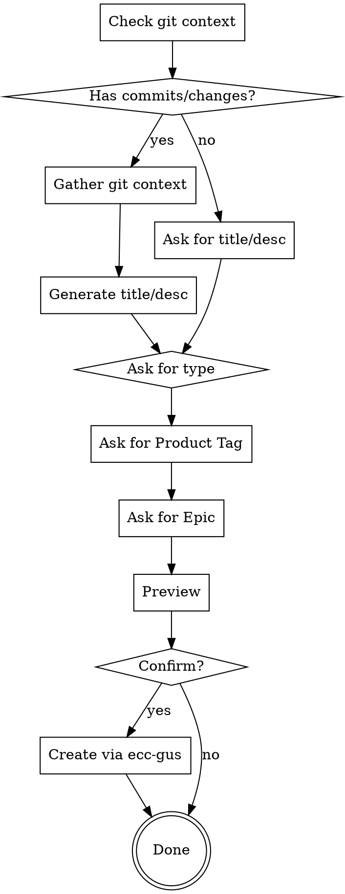

# Create GUS Item from Current Work

## Overview

Automatically create a GUS work item by gathering context from current git state (branch, commits, diff) or from user-provided goals for planned work.

## When to Use

Use when:
- User says "create a GUS item for this"
- User wants to track current work in GUS
- User has commits/changes they want to document in GUS
- User wants to create a story for planned work (before coding)

Don't use when:
- User wants to create GUS item unrelated to current work or repo

## Workflow



## Implementation

### 1. Gather Git Context (if available)

Check if there's work to document:

```bash
# Check if on a branch (not main)
git branch --show-current

# Check for commits on this branch
git log main..HEAD --oneline

# Check for uncommitted changes
git status --short
```

**If git context exists:**
- Collect branch name
- Collect commit messages (all on branch)
- Collect list of changed files
- Collect summary of changes

**If no git context (planning work):**
- Ask user for title
- Ask user for description/goals
- Skip branch/files sections in description

### 2. Generate Title and Description

**Title format:**

**With git context:**
- Use first commit message if single commit
- Use branch name if multiple commits
- Or "Fix/Add/Update [main file/feature]"
- Keep under 80 characters

**Without git context (planning):**
- Ask user for title
- Keep under 80 characters

**Description format (HTML):**

**With git context:**
```html
<b>Branch:</b> [branch-name]<br/><br/>
<b>Summary:</b><br/>
[Generated from commits and diff]<br/><br/>
<b>Changed Files:</b><br/>
- [file1]<br/>
- [file2]<br/><br/>
<b>Details:</b><br/>
[Copy commit messages or key diff sections]
```

**Without git context (planning):**
```html
<b>Goals:</b><br/>
[User-provided description of what needs to be done]<br/><br/>
<b>Acceptance Criteria:</b><br/>
[What defines "done" - ask user if not provided]
```

**Note:** Use HTML formatting (`<br/>` for line breaks, `<b>` for bold) as GUS Details__c field renders HTML.

### 3. Ask for Required Fields

**Work Item Type:**
Ask: "Is this a **Bug** or **User Story**?"

**Product Tag:**
Search for Product Tag by name:
```bash
sf data query --target-org [username] --json --query "SELECT Id, Name FROM ADM_Product_Tag__c WHERE Name LIKE '%[user_input]%' LIMIT 5"
```

Default for tableau-mcp repo: **Tableau MCP Server** (a1aEE000001u8APYAY)

**Epic (optional):**
Search within TMCP project epics:
```bash
# First filter to TMCP epics only, then search user's keywords
sf data query --target-org [username] --json --query "SELECT Id, Name FROM ADM_Epic__c WHERE Name LIKE '%[TMCP]%' AND Name LIKE '%[keyword1]%' AND Name LIKE '%[keyword2]%' LIMIT 10"
```

Example: User says "mcp apps" -> search for `Name LIKE '%[TMCP]%' AND Name LIKE '%mcp%' AND Name LIKE '%app%'`

Show matching epics and let user choose, or 'none' if not applicable

### 4. Preview Before Creating

Show preview:
```
--- GUS ITEM PREVIEW ---
Type: Bug / User Story
Title: [generated title]
Description: [generated description]
Product Tag: [tag]
Epic: [epic or "None"]
Status: New
Assignee: [current user]
---
```

Ask: "Create this GUS item? (yes/no)"

### 5. Create the GUS Item

**Load user config:**
Read `/Users/j.song/.claude/plugins/cache/salesforce-native-ai-stack/ecc-gus/1.0.0/skills/gus/config.json` for:
- `gus_username` (target org)
- `user_id` (assignee)

**Create the work item:**

**IMPORTANT:** Format Details__c with HTML (`<br/>` for line breaks, `<b>` for bold):

```bash
sf data create record --target-org [gus_username] --json --sobject ADM_Work__c --values $'Subject__c=\'[TITLE]\' Details__c=\'[HTML_FORMATTED_DESCRIPTION]\' Status__c=\'New\' RecordTypeId=\'[RECORD_TYPE_ID]\' Product_Tag__c=\'[PRODUCT_TAG_ID]\' Assignee__c=\'[USER_ID]\' Epic__c=\'[EPIC_ID]\''
```

Example:
```bash
sf data create record --target-org j.song@gus.com --json --sobject ADM_Work__c --values $'Subject__c=\'Fix duplicate logging\' Details__c=\'<b>Branch:</b> formatlog<br/><br/><b>Summary:</b><br/>Fixed duplicate logging...\' Status__c=\'New\' RecordTypeId=\'0129000000006gDAAQ\' Product_Tag__c=\'a1aEE000001u8APYAY\' Assignee__c=\'005EE000000d4ADYAY\' Epic__c=\'a3QEE000002HgRV2A0\''
```

**Return to user:**
- W-number
- GUS URL: `https://gus.lightning.force.com/lightning/r/ADM_Work__c/[RECORD_ID]/view`
- Confirmation message with summary

## Field Requirements

### User Story
- RecordTypeId: '0129000000006gDAAQ'
- Type__c: 'Feature Request'

### Bug
- RecordTypeId: (query GUS for Bug record type ID if needed)

### Always Required
- Subject__c (title)
- Details__c (description)
- Status__c: 'New'
- Product_Tag__c
- Assignee__c (current user from config)

### Optional
- Epic fields (if user provides)
- Sprint_Name__c (current sprint if known)

## Common Mistakes

**❌ Not gathering git context first**
- Always check branch, commits, diff before prompting user

**❌ Generic titles**
```
Update code
Fix bug
```

**✅ Specific titles from context**
```
Fix duplicate logging in logger.ts
Add OAuth2 authentication to MCP server
```

**❌ Creating without preview**
- Always show preview and confirm before creating

**❌ Missing required fields**
- Always validate Product Tag, RecordType, Status before creating

## Red Flags

- Creating GUS item without checking git state first
- Missing commit context in description
- Not linking to branch/files
- Skipping user confirmation
- Generic or vague titles
