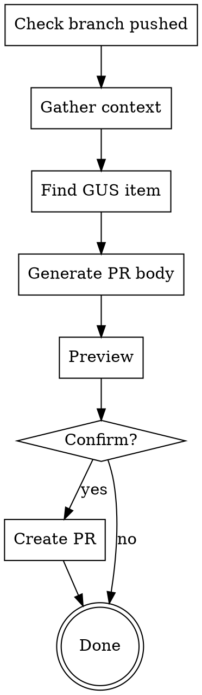

# Create Pull Request

## Overview

Automatically create a GitHub pull request using `gh pr create`, auto-filling the PR template with context from commits, branch, and GUS work item.

## When to Use

Use when:
- User says "create a PR" or "make a pull request"
- User wants to submit their branch for review
- Branch has commits ready for review

Don't use when:
- No commits on branch
- Branch is not pushed to remote

## Workflow



## Implementation

### 1. Check Branch is Pushed

```bash
# Check current branch
git branch --show-current

# Check if pushed to remote
git rev-parse --abbrev-ref --symbolic-full-name @{u}
```

If not pushed, push first:
```bash
git push --set-upstream origin [branch-name]
```

### 2. Gather Context

```bash
# Get commits on this branch
git log main..HEAD --oneline

# Get changed files
git diff --name-only main..HEAD

# Get full commit messages
git log main..HEAD --format="%B"
```

**Collect:**
- All commit messages
- Changed files
- Branch name

### 3. Find GUS Work Item

Search for GUS item linked to this branch:

```bash
# Search by branch name in GUS
sf data query --target-org j.song@gus.com --json --query "SELECT Name, Subject__c FROM ADM_Work__c WHERE Details__c LIKE '%[branch-name]%' LIMIT 1"
```

Or ask user: "What's the W-number for this work?" if not found.

### 4. Generate PR Title and Body

**PR Title Format:**
```
@W-[number] [commit message or summary]
```

Example: `@W-22784847 Fix duplicate logging and simplify error stream handling`

**PR Body from Template:**

Fill out the PR template at `.github/pull_request_template.md`:

**Description:**
```
[First commit message or summary of all commits]
```

**Motivation and Context:**
```
[Pull from GUS item description or commit messages]

GUS: W-[number]
```

**Type of Change:**
```markdown
- [x] Bug fix / New feature / etc (auto-detect from commits/GUS type)
- [ ] Other unchecked boxes
```

**How Has This Been Tested:**
```
- [x] Unit tests pass locally
[List specific tests if commit mentions them]
```

**Related Issues:**
```
GUS: W-[number]
[Link to GUS: https://gus.lightning.force.com/lightning/r/ADM_Work__c/[ID]/view]
```

**Checklist:**
```markdown
- [ ] I have updated the version in the package.json file by using `npm run version`
- [ ] I have made any necessary changes to the documentation
- [ ] I have added tests that prove my fix is effective or that my feature works
- [x] New and existing unit tests pass locally with my changes
- [ ] I have documented any breaking changes in the PR description
```

**Contributor Agreement:**
```markdown
- [x] I have read the CONTRIBUTING guidelines
```

### 5. Preview PR

Show the user:
```
--- PR PREVIEW ---
Title: @W-[number] [first commit message or branch name]
Base: main
Head: [current-branch]

[Full generated PR body]
---
```

Ask: "Create this PR? (yes/no)"

### 6. Create PR

**Try gh CLI:**
```bash
gh pr create --title "[TITLE]" --body-file /tmp/pr-body.md --base main --head [branch-name]
```

**If gh fails with "Enterprise Managed User" error:**

1. Check available GitHub accounts:
```bash
gh auth status
```

2. Parse output to find:
   - Currently active account
   - Other available accounts (look for "Logged in to github.com account [name]")

3. Identify non-EMU account:
   - EMU accounts typically have `_sfemu` suffix or company identifier
   - Personal accounts are usually simpler usernames
   - If multiple accounts exist, the non-active one is likely personal

4. Switch to non-EMU account:
```bash
gh auth switch --user [personal-account-username]
```

5. Retry PR creation:
```bash
gh pr create --title "[TITLE]" --body-file /tmp/pr-body.md --base main --head [branch-name]
```

**If no other accounts available or switch fails:**
- Report the error reason to user
- Provide the formatted PR body
- Provide GitHub PR creation URL:
  ```
  https://github.com/tableau/tableau-mcp/compare/main...[branch-name]?expand=1
  ```

**Return to user:**
- PR URL (if successful)
- Or error message + PR body + link (if failed)

## Auto-Detection Rules

### Type of Change
- Contains "fix" or "bug" in commits → Check "Bug fix"
- Contains "add" or "feature" or "implement" → Check "New feature"
- Contains "break" or "breaking" → Check "Breaking change"
- Contains "doc" or "readme" → Check "Documentation update"
- Default: leave unchecked, user will check manually

### Testing
- If tests exist and pass → Check "Unit tests pass locally"
- If commit mentions specific test → Include in "How Has This Been Tested"

## Common Mistakes

**❌ Creating PR without GUS item**
- Always link to GUS W-number

**❌ Not pushing branch first**
- Always ensure branch is pushed before creating PR

**❌ Generic PR title**
```
Update files
Changes
```

**✅ Specific PR title with GUS ID**
```
@W-22784847 Fix duplicate logging in logger.ts
@W-12345678 Add OAuth2 refresh token support
```

**❌ Empty sections in template**
- Fill out all required sections with context

## Red Flags

- Creating PR without commits
- Not linking GUS item
- Generic or missing description
- Not checking any boxes in template
- Creating PR from main branch
