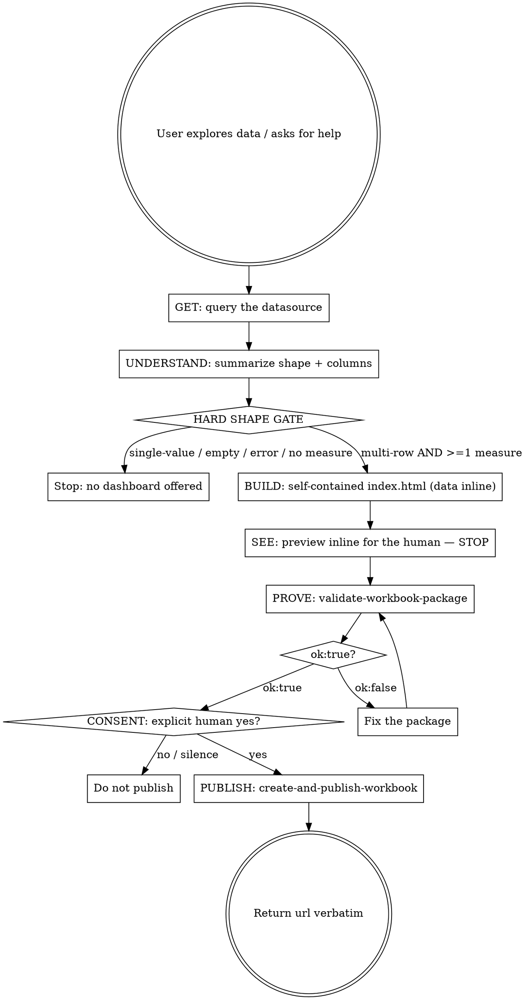

# Datasource to Dashboard

## Overview

Close the gap between raw data and a shareable visualization. When a user is exploring their Tableau site data — or asking for help with a problem their data could answer — this workflow takes them from a grounded datasource query all the way to a published Tableau workbook. It enforces a hard shape gate before offering anything, builds a self-contained artifact that carries its own data, shows the result to the human and stops, validates the package as a precondition to publish, and never publishes without an explicit human yes.

This is a client-side orchestration skill. It composes existing MCP tools (`query-datasource`, `list-datasources`, `get-datasource-metadata`, `validate-workbook-package`, `create-and-publish-workbook`). It adds no server code.

## When to Use

Use when:
- The user is exploring data on their Tableau site and a picture would help them understand it
- The user asks for help solving a problem that their site data can answer
- You have just returned multi-row data with a measure and the user would benefit from seeing it
- The user asks to "chart this", "visualize this", "make a dashboard", or "publish this to Tableau"

Don't use when:
- The result is a single-value lookup (one number, one row) — a dashboard adds nothing
- The query returned an empty result set or an error — there is nothing to visualize
- The user only wants the raw rows or a text answer and has not signaled interest in a visualization
- No numeric/measure column is present — see the Hard Shape Gate below

## Core Workflow

## Implementation

### Step 1: GET — retrieve and ground the data

Never invent or assume data. Pull it from the site.

- If you do not yet know which datasource to use, call `list-datasources` to find candidates, then `get-datasource-metadata` to learn its fields, dimensions, and measures.
- Call `query-datasource` to retrieve the actual rows. The returned rows are the single source of truth for everything downstream — the KPIs, the chart, and the inline data constant all derive from these exact values.

Ground the visualization in real returned rows. If you did not query it, do not chart it.

### Step 2: UNDERSTAND — summarize shape and columns

Before deciding anything, state plainly what came back:
- How many rows.
- Each column: its name and whether it is a dimension (category/date/label) or a measure (numeric).
- Note the obvious KPI candidates (measures you can total or average) and the obvious axis (a dimension or date to break the measure down by).

This summary is what the Hard Shape Gate is evaluated against.

### Step 3: HARD SHAPE GATE

Apply this gate strictly. Proceed to offer a dashboard **only when the results are multi-row AND include at least one numeric/measure column.**

Skip — do not offer a dashboard, just return the answer — when any of these hold:
- Single-value lookup (one number, one row): a dashboard adds nothing.
- Empty result set: there is nothing to visualize.
- The query returned an error.
- No numeric/measure column is present: there is nothing to plot on a value axis.

When the gate fails, stop the workflow here and simply return the data or answer in text. Do not build, do not preview, do not offer to publish.

When the gate passes, continue.

### Step 4: BUILD — a self-contained `index.html` with data embedded INLINE

Produce a single `index.html` that carries its own data. This is not a stylistic choice — it is required by how the workbook is built:

- `create-and-publish-workbook` builds the `.twbx` in memory and embeds your HTML as a workspace-extension. The `.twb` inside ships an **empty `<datasources />` section** — there is no `.twb` dataset binding for the HTML to read from. So the artifact must carry the data itself.
- Embed the returned rows INLINE as a JavaScript constant in the HTML (for example `const DATA = [ ...the exact returned rows... ];`). Build the KPI tiles and the chart from that constant.
- Render the chart with plain DOM/inline SVG/CSS from `DATA`. Do **not** reference external assets (no external `<script src>`, no CDN chart library, no external image or `.parquet`/`.csv` file). A referenced-but-unbundled asset resolves to nothing and the dashboard renders blank in Tableau — and nothing in the build warns you about it. Keep everything inline in the one `index.html`, or bundle every referenced file as an explicit asset.

A good minimal artifact: a title, a row of KPI tiles (measure totals/averages from `DATA`), and one simple chart (bars or a line) built from `DATA` via the DOM.

### Step 5: SEE — preview inline for the human, then STOP

Render or present the dashboard inline so the human can actually look at it. Then stop.

- Do not silently proceed to validation-then-publish. The point of this step is that a person sees the visualization before anything leaves your session.
- Invite feedback: the human may want a different chart, different KPIs, a different breakdown. Iterate on the `index.html` (back to Step 4) until they are happy with what they see.

### Step 6: PROVE — `validate-workbook-package` is the precondition to publish

Before offering to publish, validate the package with the `validate-workbook-package` tool. A green `ok:true` result is the precondition to publish.

Be precise about what `ok:true` means, and what it does not:
- `ok:true` means the package is **structurally valid**, is **under 64 MB** (the single-request publish limit), and **every referenced asset is bundled**.
- `ok:true` does **not** mean the dashboard is good. It says nothing about whether the chart is the right chart, whether the numbers are correct, or whether the design is clear.
- Concrete failure mode it guards against: a package that references an unbundled asset publishes green today and then renders **blank** in Tableau. Validation is what catches that referenced-but-missing asset before it wastes a publish.

If validation returns `ok:false`, fix the package (usually: inline the offending reference or bundle the missing asset) and validate again. Do not publish until `ok:true`.

### Step 7: CONSENT — get an explicit human yes

OFFER, NEVER AUTO-PUBLISH.

- Ask, in plain language, whether the user wants this published to their Tableau site. Publishing creates content on their site — it must be their decision.
- Require an explicit yes. Silence, ambiguity, or "looks good" about the preview is not consent to publish. Confirm the intent to publish specifically.
- If the answer is no, or there is no clear yes, do not publish. The validated package can sit ready; there is no obligation to ship it.

### Step 8: PUBLISH — and return the url verbatim

On an explicit yes and a green `ok:true`, call `create-and-publish-workbook`.

On success the result includes a `url` field — the canonical link to the published workbook. When you surface the link:
- Copy `url` **verbatim**. Do not rewrite it, do not shorten it.
- Never substitute the host (no placeholder like `your-tableau-server`).
- Preserve the `#/` routing exactly as returned.
- If `url` is absent, do not invent one — report the workbook `name` and `id` instead.

Also surface any `warnings` the publish result carries (for example an asset extension not on the reader's serve-time allow-list) so the user knows about non-fatal advisories.

## Notes

- Validated is not the same as guaranteed-good. `validate-workbook-package` proves the package loads, is under 64 MB, and references only bundled assets — nothing more. The taste and correctness of the visualization — is it the right chart, are the numbers right, is it clear and honest — remain your responsibility, not the validator's.
- The human is in the loop twice by design: once at SEE (they look at the dashboard) and once at CONSENT (they say publish). Neither is optional.
- Everything downstream of Step 1 is derived from real returned rows. If you are tempted to fabricate a data point to fill a chart, stop and query for it instead.
