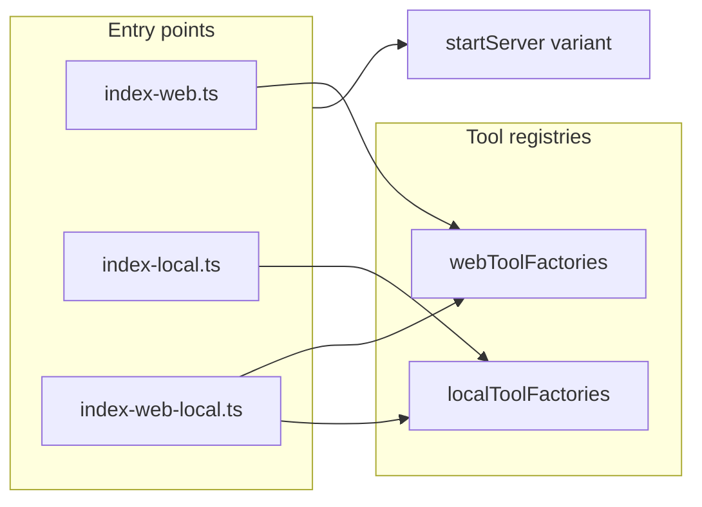

# Web / Local mode bundles and tool context split

## Goals

- **Modes**: `Web` and `Local` (combinations: Web-only, Local-only, Web+Local).
- **Build**: One esbuild output per combination (three bundles), with **tree-shaking** so Local-only does not pull the full Tableau REST/OAuth-heavy graph where avoidable.
- **Types**: `TableauToolContext` (base) → `TableauWebToolContext` and `TableauDesktopToolContext`; `TableauWebRequestHandlerExtra` / `TableauDesktopRequestHandlerExtra` extend `RequestHandlerExtra` with the matching context. Desktop/Local tools **do not** expose Tableau auth fields on `extra`.
- **Primary binary**: [`package.json`](d:/git/tableau/mcp/package.json) `bin.tableau-mcp-server` → **web-only** artifact; add explicit bins for local-only and web+local.

## Architecture (high level)

- **Mode-specific entry files** (e.g. under [`src/entries/`](d:/git/tableau/mcp/src/entries/)) import a **single** combined `toolFactories` array assembled from `webToolFactories` and/or `localToolFactories` so unused factories are not in the module graph for that build.
- Refactor [`src/scripts/build.ts`](d:/git/tableau/mcp/src/scripts/build.ts) to loop presets and write:
  - `build/index.js` — **web-only** (matches current `bin` expectation path if you keep `./build/index.js` as web-only).
  - `build/index-local.js` — Local-only.
  - `build/index-web-local.js` — both (optional extra bin name).

Adjust chmod to mark each emitted main file executable as today.

## 1. Context and callback types

**File**: [`src/tools/toolContext.ts`](d:/git/tableau/mcp/src/tools/toolContext.ts) (and possibly small adjacent files if it grows).

- **`TableauToolContext` (base)**: Fields truly shared by both backends — at minimum `config` and `server` (from current shape). Avoid placing `tableauAuthInfo`, site/user LUID helpers, or `getConfigWithOverrides` here.
- **`TableauWebToolContext`**: Extends base with current web-only fields: `_userLuid`, `_siteLuid`, `tableauAuthInfo`, `getConfigWithOverrides`, `getSiteLuid` / `getUserLuid` / setters (same behavior as today’s [`Server.registerTools`](d:/git/tableau/mcp/src/server.ts) construction).
- **`TableauDesktopToolContext`**: Extends base with Local/Desktop-specific fields (initially can be minimal, e.g. room for local base URL or session handle from config; no Tableau OAuth types).
- **`TableauWebRequestHandlerExtra`**: `TableauWebToolContext & RequestHandlerExtra<...>`.
- **`TableauDesktopRequestHandlerExtra`**: `TableauDesktopToolContext & RequestHandlerExtra<...>`.
- **Callbacks**: `TableauWebToolCallback`, `TableauDesktopToolCallback` parallel to current `TableauToolCallback`.
- **Migration**: Rename the old combined type by replacing usages: today’s `TableauRequestHandlerExtra` is effectively the **web** shape — either rename to `TableauWebRequestHandlerExtra` everywhere or keep `TableauRequestHandlerExtra` as a **deprecated alias** of `TableauWebRequestHandlerExtra` for a short period (prefer clean rename if churn is acceptable).

**Tests/mocks**: Update [`src/tools/toolContext.mock.ts`](d:/git/tableau/mcp/src/tools/toolContext.mock.ts) (and any test helpers) to provide `getMockWebRequestHandlerExtra` vs `getMockDesktopRequestHandlerExtra` as needed.

## 2. Tool classes and `logAndExecute`

**File**: [`src/tools/tool.ts`](d:/git/tableau/mcp/src/tools/tool.ts)

- Introduce **`WebTool`** (current `Tool` behavior): `callback` typed as `TableauWebToolCallback`; `logAndExecute` accepts `TableauWebRequestHandlerExtra`; keeps `requiredApiScopes` from [`getRequiredApiScopesForTool`](d:/git/tableau/mcp/src/server/oauth/scopes.ts).
- Introduce **`DesktopTool`**: `TableauDesktopToolCallback`, `TableauDesktopRequestHandlerExtra`, `requiredApiScopes` always empty (or driven by a separate map that only lists desktop tools with `{}`).
- **Telemetry in `logAndExecute`**: Today it reads `tableauAuthInfo`, `getSiteLuid()`, `getUserLuid()` ([`tool.ts` ~149–227](d:/git/tableau/mcp/src/tools/tool.ts)). For `DesktopTool`, use safe defaults (e.g. no username; empty site/user LUIDs) so telemetry does not assume web auth.

Export a **discriminated union** type for registration, e.g. `AnyRegisteredTool = WebTool<any> | DesktopTool<any>` with a `kind: 'web' | 'desktop'` field, or use `instanceof` if you prefer classes.

## 3. Server registration: branch `extra` by tool kind

**File**: [`src/server.ts`](d:/git/tableau/mcp/src/server.ts)

- Change `_getToolsToRegister` to consume a **`toolFactories` array passed in or imported from a mode-specific module** (see §4) instead of a single global [`src/tools/tools.ts`](d:/git/tableau/mcp/src/tools/tools.ts) list for all builds.
- In the `registerTool` wrapper, **branch on tool kind**:
  - **Web**: Build `TableauWebRequestHandlerExtra` exactly as today (auth getters, `getConfigWithOverrides` with `restApiArgs`, etc.).
  - **Desktop**: Build `TableauDesktopRequestHandlerExtra` from `...extra`, `config`, `server`, plus desktop context only (no `getTableauAuthInfo`).

## 4. Tool registries and mode entry points

- Split [`src/tools/tools.ts`](d:/git/tableau/mcp/src/tools/tools.ts) into:
  - `webToolFactories` — migrate existing factories to return **`WebTool`** (rename `Tool` → `WebTool` at call sites or keep class name `Tool` as alias for `WebTool` if you want minimal churn).
  - `localToolFactories` — new array; each factory returns **`DesktopTool`**.
- Add **`src/tools/toolRegistries.ts`** (or similar) exporting:
  - `getToolFactoriesForModes({ web, local })` returning a **new array** concatenation — used only from entry files so esbuild drops unused arrays in web-only / local-only builds.

**Entry files** (new):

- `src/entries/index-web.ts` — imports `startServer` + `registerToolFactories(webOnly)`; **must not** import `localToolFactories` module.
- `src/entries/index-local.ts` — local only; **must not** import `webToolFactories` (beyond what shared bootstrap absolutely needs — see §5).
- `src/entries/index-web-local.ts` — imports both.

Move current [`src/index.ts`](d:/git/tableau/mcp/src/index.ts) body into something like `src/startServer.ts` that accepts **which tool factory list to use** (injection or side-effect registration on `Server` prototype is an option; cleanest is **pass factories into `Server` constructor or `registerTools({ factories })`** to avoid global mutable registries).

## 5. Bootstrap differences per mode (Local-only)

[`src/index.ts`](d:/git/tableau/mcp/src/index.ts) today always sets `RestApi.host` and calls `getTableauServerInfo` before stdio/http — unnecessary for Local-only and may fail if `TABLEAU_SERVER` is unset.

- Refactor startup so **web** entries run existing initialization; **local-only** entry skips `RestApi.host` / `getTableauServerInfo` (or guards them behind “web mode enabled”).
- `_getToolsToRegister` currently calls `getTableauServerInfo` for `productVersion` passed into factories ([`server.ts` ~148–154](d:/git/tableau/mcp/src/server.ts)). For factories that only take `server`, this is harmless; for any tool that needs version, pass `undefined` or a constant for local-only, or make version optional in the factory signature.

## 6. Web-only code typing

- [`src/restApiInstance.ts`](d:/git/tableau/mcp/src/restApiInstance.ts): `RestApiArgs` should pick from **`TableauWebToolContext`** (or `TableauWebRequestHandlerExtra`) instead of the old monolithic type.
- [`src/tools/resourceAccessChecker.ts`](d:/git/tableau/mcp/src/tools/resourceAccessChecker.ts): All methods should take **`TableauWebRequestHandlerExtra`** only (web-only); desktop tools must not call it.

## 7. OAuth scopes for desktop tools

**File**: [`src/server/oauth/scopes.ts`](d:/git/tableau/mcp/src/server/oauth/scopes.ts)

- Extend `ToolName` / `toolScopeMap` for each **new** desktop tool with **no** MCP scopes and **no** API scopes (empty sets), so `getRequiredApiScopesForTool` returns `[]` and scope enforcement remains a no-op for those tools.
- **HTTP transport**: Tableau OAuth may still protect the MCP endpoint; desktop tools simply do not consume `TableauAuthInfo` in their `extra`. Document that distinction (transport auth vs tool auth).

## 8. Introduce placeholder desktop-only and web-only tools

Concrete tasks (names are examples — adjust to product naming):

1. **Naming**: Add to [`src/tools/toolName.ts`](d:/git/tableau/mcp/src/tools/toolName.ts) e.g. `ping-local-desktop` (desktop) — proves Local path; optional no-op web-only sample only if you want symmetry (existing tools already prove Web).
2. **Implement** `getPingLocalDesktopTool` using `DesktopTool`, callback returns a trivial JSON payload; **no** `useRestApi`, no `resourceAccessChecker`.
3. **Scopes**: Map tool in `toolScopeMap` with empty requirements.
4. **Register** only in `localToolFactories` (and thus in local-only + web-local bundles).
5. **Web-only**: Existing tools remain in `webToolFactories`; ensure none import desktop-only modules.

## 9. Build script and package metadata

- [`src/scripts/build.ts`](d:/git/tableau/mcp/src/scripts/build.ts): three `esbuild.build` calls with shared options; different `entryPoints` / `outfile`.
- [`package.json`](d:/git/tableau/mcp/package.json):
  - `"tableau-mcp-server": "./build/index.js"` → web-only entry output.
  - Add e.g. `tableau-mcp-server-local`, `tableau-mcp-server-web-local` pointing at the other bundles.
- **Tracing build**: Keep [`telemetry/tracing.ts`](d:/git/tableau/mcp/src/telemetry/tracing.ts) build as today (shared across modes) unless you need mode-specific tracing later.

## 10. Tests and CI

- Update unit tests that construct `Tool` / mock `TableauRequestHandlerExtra` to use **web** types and `WebTool`.
- Add a small test for `DesktopTool` + `getMockDesktopRequestHandlerExtra`.
- Consider one **integration** test that imports the **web** entry’s factory list (or `webToolFactories` directly) to avoid pulling local-only graph in web-focused CI if desired.
- [`src/server.test.ts`](d:/git/tableau/mcp/src/server.test.ts): `registerTools` tests may need factories injected or default web factories.

## 11. Docs (minimal)

- Update developer/contributing sections that reference a single [`tools.ts`](d:/git/tableau/mcp/src/tools/tools.ts) registry and “add one array” — document **web vs local factory lists**, **which entry** picks them up, and **WebTool vs DesktopTool**.
- Update [`.cursor/rules/tools.mdc`](d:/git/tableau/mcp/.cursor/rules/tools.mdc) checklist for dual tool types and modes.

## Risk notes

- **Type churn**: Every tool file using `Tool` and `TableauRequestHandlerExtra` becomes `WebTool` / `TableauWebRequestHandlerExtra` (mechanical but wide).
- **Empty tool list**: `_getToolsToRegister` error path must still make sense for a misconfigured env (e.g. local-only with zero local tools during development).
- **MCPB / Docker**: If [`createClaudeMcpBundleManifest.ts`](d:/git/tableau/mcp/src/scripts/createClaudeMcpBundleManifest.ts) or Docker assumes a single `build/index.js`, decide whether to ship multiple manifests or standardize on web-only for the bundle (follow-up if out of scope).
