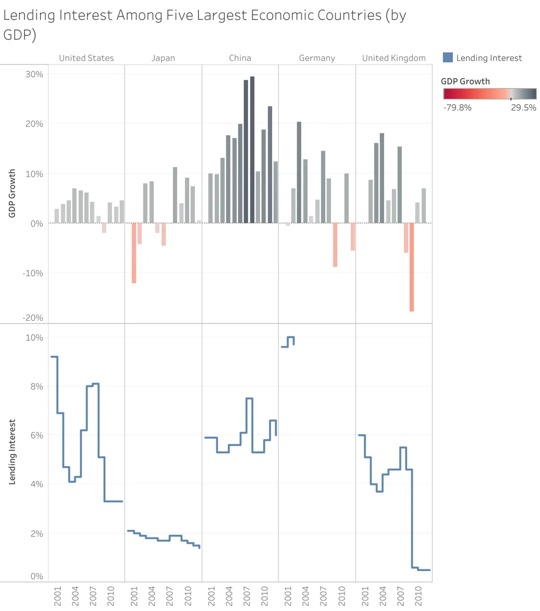

 # Tableau MCP

[](https://www.tableau.com/support-levels-it-and-developer-tools)

[](https://github.com/tableau/tableau-mcp/actions/workflows/ci.yml)

[](https://www.npmjs.com/package/@tableau/mcp-server)

## Overview

Tableau MCP is a suite of developer primitives, including tools, resources and prompts, that will
make it easier for developers to build AI applications that integrate with Tableau.

## Official Documentation

https://tableau.github.io/tableau-mcp/

## Getting Started

### Hosted Tableau MCP (Recommended for Tableau Cloud)

Tableau MCP is available as a managed service at **`https://mcp.tableau.com`**. It uses OAuth 2.1 so every user signs in with their own Tableau Cloud identity, and all existing per-user permissions are enforced automatically.

Point any MCP-compatible client at `https://mcp.tableau.com` and complete the OAuth sign-in flow when prompted.

See [Popular Client Integrations](https://tableau.github.io/tableau-mcp/docs/hosted-tableau-mcp/client-integrations) for step-by-step setup instructions for Slack, Claude, ChatGPT, and other common AI clients.

> **Tableau Server customers** and Cloud customers who require self-hosted infrastructure should see the [Enterprise Deployment](https://tableau.github.io/tableau-mcp/docs/enterprise) and [Self-Hosted Getting Started](https://tableau.github.io/tableau-mcp/docs/getting-started) guides.

### Self-Hosted / Local (npx)

The quickest way to run Tableau MCP locally. Requires [Node.js](https://nodejs.org/en/download) 22.7.5 or later — no cloning or building needed. Configure your AI tool (MCP client) with:

```json
{
  "mcpServers": {
    "tableau": {
      "command": "npx",
      "args": ["-y", "@tableau/mcp-server@latest"],
      "env": {
        "SERVER": "https://my-tableau-server.com",
        "SITE_NAME": "my_site",
        "PAT_NAME": "my_pat",
        "PAT_VALUE": "pat_value"
      }
    }
  }
}
```

For Docker, building from source, and other self-hosted options, see the [Getting Started guide](https://tableau.github.io/tableau-mcp/docs/getting-started).

### Tableau Desktop Authoring Server (from source)

The **desktop** build variant exposes a local authoring tool surface that drives a running Tableau Desktop instance over MCP stdio. It can inspect workbooks, list/inject chart templates, bind fields into worksheets, and work with dashboards.

Build it from a clone with Node.js 22.7.5 or later:

```bash
npm run build:desktop
```

Point an MCP client at the desktop entry:

```json
{
  "mcpServers": {
    "tableau-desktop": {
      "command": "node",
      "args": ["/absolute/path/to/tableau-mcp/build/index.desktop.js"]
    }
  }
}
```

Headless reference tools such as `list-templates` read the bundled snapshot. Tools that inspect or mutate a workbook require a running Tableau Desktop instance; use `list-instances` and pass the returned `session` id to those calls.

See [`README.desktop.md`](README.desktop.md) for the full desktop authoring quickstart and known gaps.

## Standalone Binaries (SEA)

The server can be packaged as a [Node.js Single Executable Application](https://tableau.github.io/tableau-mcp/docs/extras/node-sea)
so it runs without a Node.js install. Build them locally with:

```bash
npm run build:sea            # default (web) + desktop variants, host platform
npm run build:sea:desktop    # desktop variant only

# Pick variants/platforms explicitly:
npm run build:sea -- --variant desktop --platform macos-arm64 macos-x64 win-x64
```

Output lands in `build/sea/<variant>/<platform>/`. Platforms: `macos-arm64`, `macos-x64`,
`linux-x64`, `linux-arm64`, `win-x64`. macOS binaries are ad-hoc codesigned when built on a
macOS host. Each binary is fully self-contained: the desktop variant's knowledge, data,
templates, and examples are embedded into the executable as SEA assets, so it can be
distributed and run as a single file with no sibling folders.

## Deploy to Heroku

[](https://www.heroku.com/deploy?template=https://github.com/tableau/tableau-mcp)

## Example Prompts to Client

#### Prompt #1: Querying Data

```
For the Superstore Datasource, what are the top 5 states with the most sales in 2025?
```

#### Response

```
Based on the Superstore Datasource, here are the top 5 states with the most sales in 2025:
  1. California - $146,388.34
  2. New York - $93,922.99
  3. Washington - $65,539.90
  4. Texas - $43,421.76
  5. Pennsylvania - $42,688.31
California leads by a significant margin with over $146,000 in sales, followed by New York with nearly $94,000. These two states alone account for a substantial portion of the total sales across the top 5 states.
```

#### Prompt #2: Content Exploration

```
Find me the most viewed workbook within the last year.
```

#### Response

```
The most viewed workbook within the last year is:

Global Connections
- Owner: John Doe
- Project: Marketing
- Views in last year: 523
- Last Modified: September 2, 2025
- Workbook ID: 111fb672-9401-4913-a167-17b3d89a3e4f
```

#### Prompt #3: Getting a View

```
Show me the "Economy" view in the "Finances" project.
```

#### Response


