# Enabling OAuth

:::warning

Tableau Server 2025.3+ only. Tableau Cloud is not supported yet but is coming soon ETA Q2 2026.

Otherwise, you can still test by running the MCP server locally.

:::

When a URL for `OAUTH_ISSUER` is provided, the MCP server will act as an OAuth 2.1 resource server,
capable of accepting and responding to protected resource requests using encrypted access tokens.
When enabled, MCP clients will first require logging in via Tableau OAuth to connect to the MCP
server. For more information, please see the
[MCP Authorization spec](https://modelcontextprotocol.io/specification/2025-06-18/basic/authorization).

<hr />

## Environment Variables

When OAuth is enabled, the following environment variables also apply or have additional meaning:

### `AUTH`

The method the MCP server uses to authenticate to the Tableau REST APIs.

- Defaults to `oauth` when OAuth is enabled.
- Can still be set to other authentication methods. See [Authentication](env-vars#auth) for options.
- When set to a value _other_ than `oauth`, the MCP server will still be protected from unauthorized
  access by OAuth but will _not_ use the Tableau session initiated by the Tableau OAuth flow to
  authenticate to the Tableau REST APIs. For example, if `AUTH` is set to `pat`, the MCP server will
  use the values of [`PAT_NAME`](authentication/pat#pat_name) and
  [`PAT_VALUE`](authentication/pat#pat_value) to authenticate to the Tableau REST APIs.

<hr />

### `OAUTH_ISSUER`

The issuer of the OAuth server. This should be the host of the MCP server.

- Required if `AUTH` is `oauth`. For testing, use `http://127.0.0.1:3927`.
- Required if `TRANSPORT` is `http` unless opted out with [`DISABLE_OAUTH`](#disable_oauth).

<hr />

### `TRANSPORT`

The MCP transport type to use for the server.

- Defaults to `http` when OAuth is enabled.
- Must be `http` when OAuth is enabled.

<hr />

### `SERVER`

- When [`AUTH`](#auth) is `oauth`, leave this empty to support any Tableau Cloud pod determined by
  the site the user signed into when connecting to the MCP server.

<hr />

### `SITE_NAME`

The target Tableau site for OAuth.

- When [`AUTH`](#auth) is `oauth`, leaving this empty means any site will be supported, determined
  by the site the user signed into when connecting to the MCP server.

<hr />

### `OAUTH_REDIRECT_URI`

The redirect URI for the OAuth flow.

- Default: `${OAUTH_ISSUER}/Callback`
- Recommended to not define a value at all and just rely on its default value.
- Path must be `/Callback` (case-sensitive).

:::info

Tableau Server administrators must also use
[tsm](https://help.tableau.com/current/server/en-us/cli_configuration-set_tsm.htm) to set
`oauth.allowed_redirect_uri_hosts` to the host of the MCP server.

The value should be the same as [`OAUTH_ISSUER`](#oauth_issuer) but without the protocol or any
trailing slash.

```cmd
tsm configuration set -k oauth.allowed_redirect_uri_hosts -v tableau-mcp.example.com
tsm pending-changes apply
```

:::

<hr />

### `OAUTH_JWE_PRIVATE_KEY_PATH`

The absolute path to the RSA private key (.pem) file used to decrypt the OAuth access token.

- Required.
- Only PEM format is supported.

:::info

The access token issued by the MCP server is encrypted using JWE (JSON Web Encryption) using an RSA
public key. This public key is derived from the provided RSA private key.

MCP clients provide this encrypted access token to the MCP server on the `Authorization` header of
its requests. The MCP server decrypts the access token using the provided private key and uses the
Tableau access token held within to authenticate subsequent requests to Tableau APIs. Any requests
to the MCP server that do not have a valid access token will be rejected.

If you need a private key, you can generate one using
[openssl-genrsa](https://docs.openssl.org/3.0/man1/openssl-genrsa/) e.g.

```cmd
openssl genrsa -out private.pem
```

:::

<hr />

### `OAUTH_JWE_PRIVATE_KEY_PASSPHRASE`

The passphrase for the private key if it is encrypted.

<hr />

### `OAUTH_AUTHORIZATION_CODE_TIMEOUT_MS`

The timeout for the OAuth authorization codes.

- Default: 10 seconds.
- Max: 1 hour.

<hr />

### `OAUTH_ACCESS_TOKEN_TIMEOUT_MS`

The timeout for the OAuth access tokens.

- Default: 1 hour.
- Max: 30 days.

<hr />

### `OAUTH_REFRESH_TOKEN_TIMEOUT_MS`

The timeout for the OAuth refresh tokens.

- Default: 30 days.
- Max: 1 year.

<hr />

### `DISABLE_OAUTH`

:::warning

When `TRANSPORT` is `http`, the default behavior changes to require protecting your MCP server with
OAuth as a security best practice.

To opt out of this behavior at your own risk, set `DISABLE_OAUTH` to `true`.

This is not recommended as your MCP server will not be protected from unauthorized access.

:::

- Default: `false`

<hr />

## Sequence Diagram

```mermaid
sequenceDiagram
    participant Client as MCP Client<br/>(Claude/Cursor/VS Code)
    participant MCP as MCP Server<br/>(OAuth Provider)
    participant Tableau as Tableau Server<br/>(OAuth Authorization Server)
    participant User as User<br/>(Browser)

    Note over Client, User: MCP OAuth 2.1 Flow with PKCE

    %% Step 1: Initial Request (401 Unauthorized)
    Client->>MCP: 1. Request to protected resource<br/>(no Bearer token)
    MCP->>Client: 2. 401 Unauthorized<br/>WWW-Authenticate: Bearer realm="MCP",<br />resource_metadata="/.well-known/oauth-protected-resource"

    %% Step 2: Resource Metadata Discovery
    Client->>MCP: 3. GET /.well-known/oauth-protected-resource
    MCP->>Client: 4. Resource metadata<br/>{resource, authorization_servers, bearer_methods_supported}

    %% Step 3: Authorization Server Metadata
    Client->>MCP: 5. GET /.well-known/oauth-authorization-server
    MCP->>Client: 6. Authorization server metadata<br/>{issuer, authorization_endpoint, token_endpoint,<br/>registration_endpoint, response_types_supported, etc.}

    %% Step 4: Dynamic Client Registration (Optional)
    Client->>MCP: 7. POST /oauth/register<br/>{redirect_uris}
    MCP->>Client: 8. Client registration response<br/>{client_id, redirect_uris,<br/>grant_types, response_types, token_endpoint_auth_method}

    %% Step 5: Authorization Request with PKCE
    Note over Client:Generate code_verifier and code_challenge (S256)
    Client->>MCP: 9. GET /oauth/authorize?<br/>client_id=...<br />&redirect_uri=...<br />&response_type=code<br/>&code_challenge=...<br/>&code_challenge_method=S256<br/>&state=...

    Note over MCP: Generate tableauState, authKey<br/>Store pending authorization<br/>Generate tableauClientId
    MCP->>Tableau: 10. Redirect to Tableau OAuth<br/>GET /oauth2/v1/auth?<br/>client_id=...<br/>&code_challenge=...<br/>&response_type=code<br/>&redirect_uri=/Callback<br/>&state=...<br/>&device_id=...<br/>&target_site=...<br/>&device_name=...<br/>&client_type=tableau-mcp

    %% User Authorization
    Tableau->>User: 11. OAuth login page
    User->>Tableau: 12. Enter credentials & authorize
    Tableau->>MCP: 13. Redirect to /Callback<br/>?code=tableauAuthZCode<br/>&state=...

    %% Step 6: OAuth Callback
    Note over MCP: Validate state parameter<br/>Exchange Tableau authz code for tokens<br/>Get user session info
    MCP->>Tableau: 14. POST /oauth2/v1/token<br/>{grant_type: "authorization_code",<br/>code: tableauAuthZCode,<br/>redirect_uri: /Callback,<br/>client_id: "...",<br/>code_verifier: "S256"}
    Tableau->>MCP: 15. Token response<br/>{access_token, refresh_token, expires_in, origin_host}

    Note over MCP: get server session to verify authentication
    MCP->>Tableau: 16. GET /api/3.26/sessions/current

    Note over MCP: Generate MCP authorization code<br/>Store authorization code with user info & tokens
    MCP->>Client: 17. Redirect to client callback<br/>?code=mcpAuthCode<br/>&state=originalState

    %% Step 7: Token Exchange with PKCE Verification
    Client->>MCP: 18. POST /oauth/token<br/>{grant_type: "authorization_code",<br/>code: mcpAuthCode,<br/>redirect_uri: ...,<br/>code_verifier: originalCodeVerifier,<br/>client_id: ...}

    Note over MCP: Verify PKCE code_verifier<br/>Generate JWE access token<br/>Store refresh token
    MCP->>Client: 19. Token response<br/>{access_token: JWE,<br />token_type: "Bearer",<br/>expires_in: ...,<br />refresh_token: ...,<br/>scope: "read"}

    %% Step 8: Authenticated MCP Requests
    Note over Client, MCP: Client can now make authenticated requests
    Client->>MCP: 20. Request to protected resource<br/>Authorization: Bearer JWE_TOKEN
    Note over MCP: Decrypt JWE, validate JWT<br/>Extract Tableau tokens & user info
    MCP->>Tableau: 21. API call using Tableau access token
    Tableau->>MCP: 22. API response
    MCP->>Client: 23. MCP response with data

    %% Token Refresh Flow (when needed)
    Note over Client, MCP: When access token expires
    Client->>MCP: 24. POST /oauth/token<br/>{grant_type: "refresh_token",<br/>refresh_token: refreshTokenId}
    Note over MCP: Validate refresh token<br/>Try to refresh Tableau tokens<br/>Generate new JWE access token
    MCP->>Tableau: 25. POST /oauth2/v1/token<br/>{grant_type: "refresh_token",<br/>refresh_token: ...,<br/>client_id: ...}
    Tableau->>MCP: 26. New token response (or error)
    MCP->>Client: 27. New access token or error

    %% Error Handling
    Note over Client, MCP: Error scenarios
    alt Invalid/Expired Token
        Client->>MCP: Request with invalid token
        MCP->>Client: 401 Unauthorized<br/>{error: "invalid_token"}
        Note over Client: Client should refresh token or re-authenticate
    end

    alt Tableau API Error
        MCP->>Tableau: API call
        Tableau->>MCP: Error response
        MCP->>Client: Error response with details
    end
```



### Key Components

#### Security Features

- **PKCE (RFC 7636)**: Code challenge/verifier for public clients
- **JWE Encryption**: Access tokens encrypted with RSA-OAEP-256/A256GCM
- **State Validation**: Prevents CSRF attacks
- **Time-limited Tokens**: Authorization codes (10 seconds), access tokens (1 hour), refresh tokens
  (30 days)

#### Token Types

1. **Tableau OAuth Tokens**: Direct from Tableau Server
2. **MCP Authorization Code**: Short-lived code for token exchange
3. **MCP Access Token**: JWE-encrypted token containing Tableau credentials
4. **MCP Refresh Token**: For obtaining new access tokens

#### Endpoints

- `/.well-known/oauth-protected-resource`: Resource metadata discovery
- `/.well-known/oauth-authorization-server`: Authorization server metadata
- `/oauth/register`: Dynamic client registration
- `/oauth/authorize`: Authorization endpoint with PKCE
- `/Callback`: OAuth callback handler
- `/oauth/token`: Token exchange and refresh
