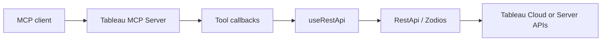

# Design document (from PRD)

This document translates the product requirements document (PRD) into an engineering design for **Tableau MCP**. It is intended for reviewers and implementers.

## Source PRD

- **PRD link:** [Google Doc](https://docs.google.com/document/d/1BIhQBq8sSRdQOzlLcQZn0S1pR4lHcJi8Q5HE9sQatcs/edit?usp=sharing)

:::note PRD access

The PRD could not be read automatically (the document requires Google sign-in). **Paste the PRD text or bullet summary into the sections marked “(from PRD)” below**, or export the doc (**File → Download → Plain text**) and merge the content into this file.

:::

## 1. Summary

**One paragraph:** What we are building and why it matters for Tableau MCP users (agents, admins, analysts).

_(from PRD — replace this paragraph.)_

## 2. Goals

| # | Goal | Success signal (how we know we met it) |
|---|------|----------------------------------------|
| 1 | _(from PRD)_ | _(measurable or observable)_ |
| 2 | | |

## 3. Non-goals

Explicitly out of scope for this initiative (to prevent scope creep):

- _(from PRD)_
- _

## 4. Users and scenarios

| Persona | Need | Primary scenario |
|---------|------|-------------------|
| _(e.g. MCP client user)_ | | |
| _(e.g. Tableau admin)_ | | |

_(Expand from PRD.)_

## 5. Product requirements

Functional requirements (numbered for traceability to tests and PRs):

1. _(from PRD — FR-001)_
2. _

Non-functional requirements (performance, security, observability):

- _(from PRD)_

## 6. Current state (repository)

Tableau MCP today is a Node.js MCP server that exposes **tools** registered in [`src/tools/tools.ts`](https://github.com/tableau/tableau-mcp/blob/main/src/tools/tools.ts). Each tool:

1. Is constructed by a **factory** (e.g. `getListDatasourcesTool`) that returns a `Tool` instance with name, Zod `paramsSchema`, and `callback`.
2. Is registered on the MCP server in [`src/server.ts`](https://github.com/tableau/tableau-mcp/blob/main/src/server.ts) via `registerTools`, which wraps the callback with config and Tableau auth context.
3. Calls Tableau APIs through **`useRestApi`** in [`src/restApiInstance.ts`](https://github.com/tableau/tableau-mcp/blob/main/src/restApiInstance.ts), which builds an authenticated [`RestApi`](https://github.com/tableau/tableau-mcp/blob/main/src/sdks/tableau/restApi.ts) client for the configured `SERVER` host.
4. Maps HTTP to typed clients: Zodios endpoint definitions under `src/sdks/tableau/apis/`, method classes under `src/sdks/tableau/methods/`.

Configuration is **environment-driven** (see [Environment variables](/docs/configuration/mcp-config/env-vars.md)); `SERVER` and auth-related variables are required for REST calls.

**Relevant to most PRDs:** OAuth/PAT scopes for tools are declared in [`src/server/oauth/scopes.ts`](https://github.com/tableau/tableau-mcp/blob/main/src/server/oauth/scopes.ts) and tool names in [`src/tools/toolName.ts`](https://github.com/tableau/tableau-mcp/blob/main/src/tools/toolName.ts).

_(Add PRD-specific “as-is” behavior or gaps here.)_

## 7. Proposed design

### 7.1 High-level approach

Describe the chosen approach in plain language (one or two paragraphs): new tools vs extending existing tools, new REST endpoints vs reusing Metadata/VDS/Pulse, etc.

_(from PRD + engineering judgment.)_

### 7.2 Architecture (conceptual)



_(Adjust nodes if the PRD introduces new subsystems, queues, or external services.)_

### 7.3 MCP surface area

| Item | Decision |
|------|----------|
| New tool names | _(e.g. `list-…`, `get-…`)_ |
| Tool groups / scoping | _(see [tool scoping](/docs/configuration/mcp-config/tool-scoping.md))_ |
| MCP OAuth scopes | _(e.g. `tableau:mcp:…`)_ |
| Tableau API / JWT scopes | _(e.g. `tableau:content:read`, …)_ |

### 7.4 REST API and SDK changes

| Tableau API (doc link) | HTTP | New or existing in repo |
|------------------------|------|-------------------------|
| _(e.g. List Extract Refresh Tasks)_ | `GET …` | _New `tasksApi` / extend `RestApi`_ |

List new Zod schemas (`src/sdks/tableau/types/`), new `apis/*.ts` endpoints, and new or extended `methods/*.ts` classes.

### 7.5 Configuration and deployment

- New or changed **environment variables** (document in `env-vars.md` if user-facing).
- Changes to Docker, Heroku, or HTTP server config (if any).

### 7.6 Security and privacy

- AuthZ: which roles/scopes are required; least privilege for JWT scopes.
- Data handling: PII, logs, telemetry (see project privacy and logging patterns).
- Threat considerations specific to this feature.

### 7.7 Observability

- Logging: structured fields to add (avoid secrets).
- Metrics or telemetry hooks if applicable.

## 8. Alternatives considered

| Option | Pros | Cons | Outcome |
|--------|------|------|---------|
| A | | | |
| B | | | |

## 9. Testing strategy

| Layer | What to cover |
|-------|----------------|
| Unit | Zod schemas, pure helpers, scope mapping |
| Integration / e2e | Tool invocation against a real or test Tableau site (see [e2e tests](./e2e-tests.md)) |

_(Add PRD-specific acceptance criteria as test cases.)_

## 10. Rollout and documentation

- [ ] User-facing doc under `docs/docs/` (tools, config) if behavior is visible to operators.
- [ ] `README` or getting-started updates if setup changes.
- [ ] Release note or migration note (breaking changes).

## 11. Risks and open questions

| Risk / question | Impact | Mitigation / owner |
|-----------------|--------|---------------------|
| | | |

## 12. Appendix: PRD excerpt (optional)

Paste key paragraphs or a table from the PRD here for offline review.

```
(Paste from Google Doc)
```
