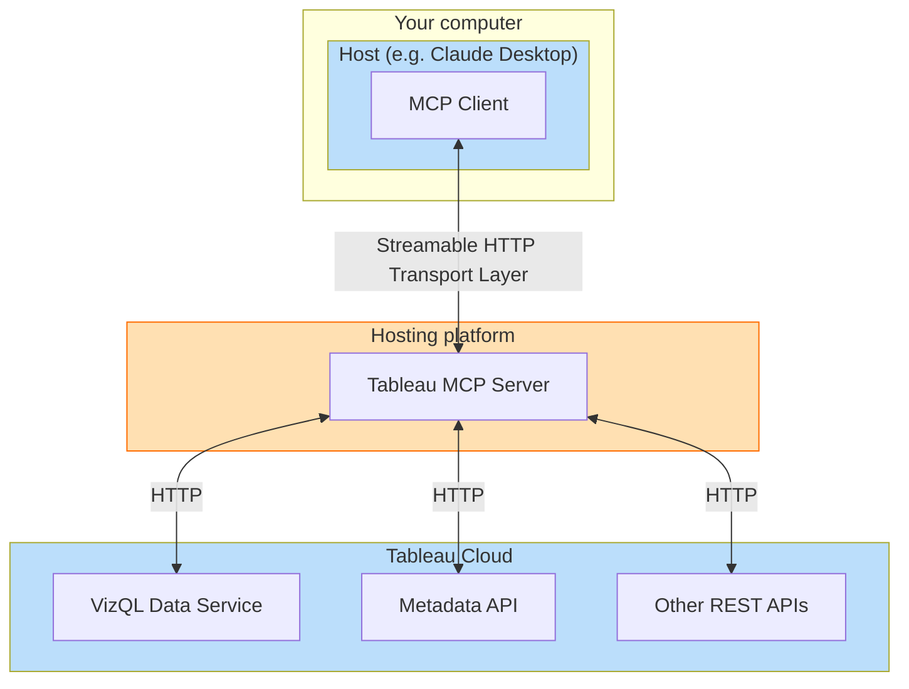
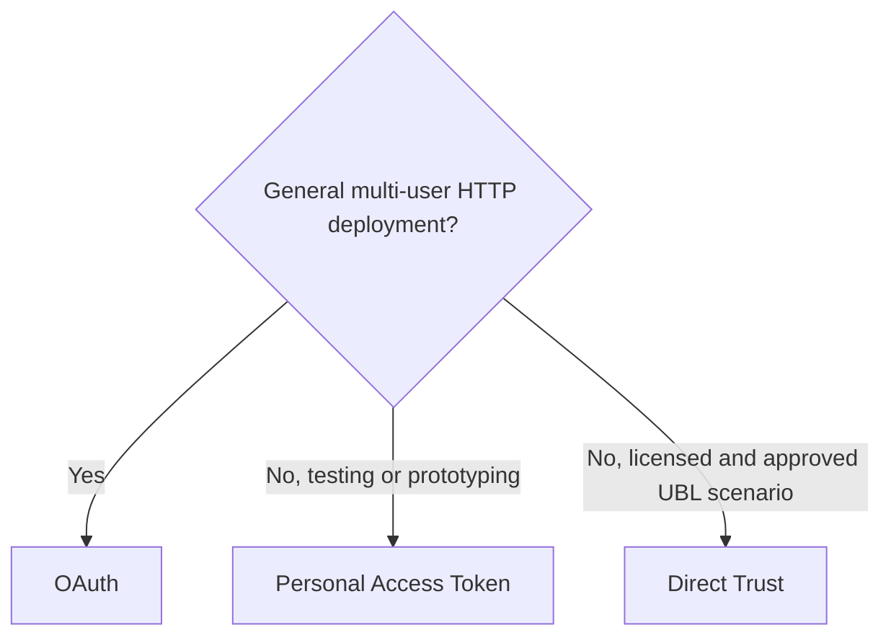

# Tableau MCP Deployment Guide for Tableau Cloud Customers

This guide provides step-by-step instructions for Tableau Cloud customers to deploy the Tableau MCP
server in a self-hosted environment.

:::info

Self-hosting Tableau MCP is not required for Cloud customers. Tableau's first party, hosted MCP
server is available at https://mcp.tableau.com

:::

## Overview

The Tableau MCP server is a lightweight [Node.js](https://nodejs.org/) web application that uses
[Express](https://expressjs.com/) and the
[official TypeScript SDK](https://github.com/modelcontextprotocol/typescript-sdk) for MCP servers.
It is capable of handling multiple HTTP requests from clients and communicates with them using the
[Streamable HTTP](https://modelcontextprotocol.io/specification/2025-11-25/basic/transports#streamable-http)
MCP transport.

Self-hosting the Tableau MCP server means deploying the web application in an environment capable of
being accessed by multiple users simultaneously, similar to any other web application.

## Prerequisites

Before beginning the deployment process, ensure the following prerequisites are met:

- **Operating System**: Any operating system that is capable of running Docker or Node.js 22.7.5 or
  higher.
  - **Node.js**: Install Node.js 22.7.5 or higher. Not required if using Docker or a Node.js Single
    Executable Application.
- **SKU**: Tableau MCP is a lightweight, self-contained Node.js web application that should not
  require a large or expensive SKU. You should do capacity planning based on your needs but
  something like an EC2 T4g small instance, Heroku Standard-2X dyno, or Azure Standard_B2als_v2
  should be sufficient.
- **Network Access**: Ensure the MCP server machine can communicate with Tableau Cloud. The MCP
  server makes requests to the Tableau Cloud REST APIs so it must be able to communicate with it.
- **User Access**: This guide steps through running the MCP server over a local address. Exposing it
  to your users and only your users (e.g. via reverse proxy or tunnel) is left to the reader.
  Additional necessary precautions are described in the "Network isolation" section below.
- **Tableau MCP build**: One of the following:
  - [NPM package](https://www.npmjs.com/package/@tableau/mcp-server)
  - [Docker container](https://github.com/tableau/tableau-mcp/pkgs/container/tableau-mcp)
  - Node.js [single executable application](../extras/node-sea.md)
  - The `build` directory from a local build of [the repo](https://github.com/tableau/tableau-mcp)
    or your fork.

### Network Isolation

Before making the Tableau MCP server deployment accessible to your users, ensure its network
configuration guarantees it can only be accessed by the users you expect. In other words, don't open
it up to the Internet, and definitely don't do that with OAuth disabled. Without OAuth, anyone who
can make requests to the MCP server can effectively access Tableau data on behalf of the owner of
the credential specified in the configuration.

### Basic architecture



## Deployment Guide

### Step 1: Determine your authentication approach

The tools exposed by the Tableau MCP server call the Tableau Cloud REST APIs which require signing
in with a Tableau Cloud user. Tableau MCP provides several options for specifying which credential
is used when it signs in to the REST APIs. Using the below decision tree, determine which
authentication option is most appropriate.



<hr />

- **Are you configuring a general multi-user HTTP deployment?**
  - Yes: Use OAuth so Tableau MCP can authenticate each user and make Tableau REST API requests on
    that user's behalf.
  - No, I am testing or prototyping: A Personal Access Token can be used for basic testing, with the
    concurrency caveat noted below.
  - No, I have a licensed and approved user-based licensing (UBL) scenario: A Direct Trust Connected
    App may be appropriate. Confirm this with your Tableau licensing and security guidance before
    using a non-OAuth HTTP configuration.

### Step 2: Prepare the Configuration

The MCP server relies on environment variables for configuration. Please set environment variables
however your hosting platform and security model allows. Several examples for common configurations
are provided below and assume the use of a `.env` file in the working directory for simplicity.

#### Required Environment Variables

- The `SERVER` environment variable is always required; the value is the URL of your Tableau Cloud
  pod on which your Tableau site(s) exist(s) (not the MCP server).
- Other required variables depend on your desired authentication mechanism and are as shown in the
  examples below

<hr />

#### Example: Authentication with Personal Access Token (PAT)

Create a PAT using the instructions provided in
[Personal Access Tokens - Tableau](https://help.tableau.com/current/server/en-us/security_personal_access_tokens.htm).
All requests made to the MCP server will use the PAT to authenticate to the underlying Tableau REST
APIs. For general multi-user HTTP deployments, prefer OAuth. PAT-based HTTP configurations are
intended for testing/prototyping or licensed and approved UBL scenarios. ⚠️ PATs also should not be
used when you expect simultaneous requests from multiple clients since they cannot be used
concurrently.

```
SERVER=https://10ax.online.tableau.com
SITE_NAME=MySite
TRANSPORT=http

AUTH=pat
PAT_NAME=my-pat
PAT_VALUE=AbC...

# When TRANSPORT=http, requiring OAuth is the default
# It must be disabled explicitly to use a different auth mechanism
DANGEROUSLY_DISABLE_OAUTH=true
```

<hr />

#### Example: Authentication with Direct Trust

Create a Direct Trust Connected App using the instructions provided in
[Configure Connected Apps with Direct Trust - Tableau](https://help.tableau.com/current/online/en-us/connected_apps_direct.htm).
All requests made to the MCP server will use the provided details of the Connected App to generate a
scoped
[JSON Web Token (JWT)](https://help.tableau.com/current/api/rest_api/en-us/REST/rest_api_ref_authentication.htm#jwt)
and use it to authenticate to the Tableau REST APIs. For general multi-user HTTP deployments, prefer
OAuth. Direct Trust with OAuth disabled is intended for testing/prototyping or deployments that are
licensed and approved for UBL, not as the default shared-account end-user deployment path.

```
SERVER=https://10ax.online.tableau.com
SITE_NAME=MySite
TRANSPORT=http

AUTH=direct-trust
JWT_SUB_CLAIM=username
CONNECTED_APP_CLIENT_ID=211a3762-cd0d-49bf-ae25-be98198bf4f5
CONNECTED_APP_SECRET_ID=43a6eeac-eb2f-4f3e-9af9-3cb44fe200fd
CONNECTED_APP_SECRET_VALUE=DeF...

# When TRANSPORT=http, requiring OAuth is the default
# It must be disabled explicitly to use a different auth mechanism
DANGEROUSLY_DISABLE_OAUTH=true
```

<hr />

#### Example: Authentication with OAuth

With OAuth enabled, when connecting to the MCP server the first time, each user will be required to
sign in to their Tableau Cloud site the same way they would when viewing a dashboard in their web
browser. Once a user successfully connects, the MCP server will make its requests to the underlying
Tableau REST APIs as the user themself. The Tableau authorization server will issue the MCP client
an access token which will be included with each subsequent request when calling MCP tools, where it
will be validated before allowing the tool to be executed.

##### Environment Variables

```
SERVER=https://10ax.online.tableau.com
SITE_NAME=MySite

OAUTH_ISSUER=https://sso.online.tableau.com
OAUTH_RESOURCE_URI=https://tableau-mcp.superstore.com
ADVERTISE_API_SCOPES=true
OAUTH_EMBEDDED_AUTHZ_SERVER=false

```

### Step 3: Run the MCP Server

Now that the environment variables are set (or your `.env` file is populated) you can start the
server!

#### Docker

Replace `latest` with a
[specific version](https://github.com/tableau/tableau-mcp/pkgs/container/tableau-mcp/) to prevent
auto-upgrading with each launch e.g. `1.17.12`

```shell
docker run -d --name tableau-mcp --env-file .env -p 3927:3927 ghcr.io/tableau/tableau-mcp:latest
```

<hr />

#### Node.js (NPM package)

Replace `latest` with a
[specific version](https://www.npmjs.com/package/@tableau/mcp-server?activeTab=versions) to prevent
auto-upgrading with each launch e.g. `1.17.12`

Command:

```shell
npx -y @tableau/mcp-server@latest
```

Output:

```shell
tableau-mcp v1.17.12 streamable HTTP server available at http://localhost:3927/tableau-mcp
```

<hr />

#### Node.js Single Executable Application

Windows command:

```cmd
tableau-mcp.exe
```

Linux command:

```shell
./tableau-mcp
```

Output:

```shell
tableau-mcp v1.17.12 streamable HTTP server available at http://localhost:3927/tableau-mcp
```

<hr />

#### Node.js (local build)

Command:

```shell
node build/index.js
```

Output:

```shell
tableau-mcp v1.17.12 streamable HTTP server available at http://localhost:3927/tableau-mcp
```

### Step 4: Optional configuration

#### Available tools

Tableau MCP has a lot of tools, some of which may not be necessary for your desired workflows.

- [INCLUDE_TOOLS](../configuration/mcp-config/env-vars#include_tools) allows you to specify which
  tools will be made available to your users.
- [EXCLUDE_TOOLS](../configuration/mcp-config/env-vars#exclude_tools) allows you to specify which
  tools should not be made available to your users. All others will be available.

Only one of these environment variables can be specified at a time. Their values are a
comma-separated list of tool names, or tool group names. A tool group is a collection of tools. For
the list of tools and their groupings, see
[toolName.ts](https://github.com/tableau/tableau-mcp/blob/main/src/tools/web/toolName.ts).

Examples:

1. **Datasource querying only**. `datasource` is a tool group name that includes all tools for
   getting datasource metadata and querying the data sources themselves.

   ```
   INCLUDE_TOOLS=datasource
   ```

2. **Exclude Pulse tools and the Get View Image tool**. The Pulse tools can be easily excluded using
   the `pulse` tool group. This example also excludes the `get-view-image` tool to demonstrate tool
   groups and individual tools can be provided simultaneously.

   ```
   EXCLUDE_TOOLS=pulse,get-view-image
   ```

#### Tool Scoping

The Tableau MCP server can be configured to limit the scope of its tools to a set of data sources,
workbooks, views, projects, or tags. For example, this can be helpful if your sites have hundreds of
data sources but you only want a select few to be made available when constructing MCP tool call
results.

Each value is a comma-separated list. For more information, see
[Tool Scoping | Tableau MCP](../configuration/mcp-config/tool-scoping).

Examples:

1. Limit all requests and filter results to content that exists within a specific project and has a
   specific tag.

   ```
   INCLUDE_PROJECT_IDS=d87d843b-4326-4ce3-bc50-a68c1e6c9ca5
   INCLUDE_TAGS=sales
   ```

2. Only allow clients to query a single data source. The List Datasources tool will only return this
   specific data source, and if a client attempts to query any other data source it will result in
   an error.

   ```
   INCLUDE_DATASOURCE_IDS=2d935df8-fe7e-4fd8-bb14-35eb4ba31d4
   ```

3. Only allow clients to query a single workbook. The Get Workbook and List Workbooks tools will
   only return information about this specific workbook.

   ```
   INCLUDE_WORKBOOK_IDS=222ea993-9391-4910-a167-56b3d19b4e3b
   ```

#### Telemetry

##### Service Telemetry

Tableau MCP uses a plugin architecture that allows you to provide your own telemetry provider to
record service level metrics and latency observations.

1. Create a class that implements the
   [TelemetryProvider](https://github.com/tableau/tableau-mcp/blob/main/src/telemetry/types.ts)
   interface. Tableau MCP will import it dynamically at runtime.
2. Set environment variables:

   ```
   TELEMETRY_PROVIDER=custom
   TELEMETRY_PROVIDER_CONFIG='{"module":"./path/to/my-telemetry-provider.js"}'
   ```

##### Product Telemetry

By default, Tableau MCP will send basic product data to Tableau's telemetry endpoint for each tool
call, including tool name, request ID, session ID, and site name.

To disable this, set `PRODUCT_TELEMETRY_ENABLED=false`. Alternatively, you can block outbound
traffic to Tableau's telemetry endpoints as described in
[Basic Product Data - Tableau](https://help.tableau.com/current/server/en-us/usage_data_basic_product_data.htm).

##### Server Logging

By default, Tableau MCP sends notifications to MCP clients containing the request and response
traces for each request Tableau MCP tools make to the Tableau REST APIs. Many clients will save
these notifications to their own log files, but if you need a way to gather and audit these traces,
server-level logging can be enabled. See
[ENABLED_LOGGERS](../configuration/mcp-config/env-vars#enabled_loggers) for more information.

```
ENABLED_LOGGERS=fileLogger
FILE_LOGGER_DIRECTORY=D:\logs
```

##### OAuth + alternate authentication

When OAuth is enabled by providing a value for the `OAUTH_ISSUER`, users must first sign into their
Tableau Cloud site to access the MCP server. By default, the MCP server will then make its requests
to the underlying Tableau REST APIs on behalf of the user themself. **It is highly recommended to
rely on this default behavior**, however it can be configured if deemed unnecessary or undesirable
for your workflow.

The `AUTH` environment variable can still be set to any of the non-OAuth authentication mechanisms,
e.g. `direct-trust`. In the below example, the MCP server will still be protected from unauthorized
access by OAuth—requiring users to first sign in to their Tableau site—but the user and site context
will be mostly\* ignored from then on by the MCP server. Authentication to the underlying REST API
requests will use the Direct Trust Connected App instead. For OAuth-backed per-user access, set the
generated JWT's `sub` claim to the signed-in Tableau user with `JWT_SUB_CLAIM={OAUTH_USERNAME}`. A
hard-coded `sub` claim should only be used for deployments that are licensed and approved for that
user-based licensing (UBL) pattern.

```
SERVER=https://10ax.online.tableau.com
SITE_NAME=MySite

OAUTH_ISSUER=https://sso.online.tableau.com
OAUTH_RESOURCE_URI=https://tableau-mcp.superstore.com
ADVERTISE_API_SCOPES=true
OAUTH_EMBEDDED_AUTHZ_SERVER=false

AUTH=direct-trust
JWT_SUB_CLAIM={OAUTH_USERNAME}
CONNECTED_APP_CLIENT_ID=211a3762-cd0d-49bf-ae25-be98198bf4f5
CONNECTED_APP_SECRET_ID=43a6eeac-eb2f-4f3e-9af9-3cb44fe200fd
CONNECTED_APP_SECRET_VALUE=DeF...
```

## Testing Tableau MCP

You've got Tableau MCP deployed but now you want to test it.

### Step 1: Make a basic request

The requests MCP clients make to MCP servers are generally POST requests, so if you make a GET
request (e.g. from the web browser) to http://127.0.0.1:3927/tableau-mcp, you'll see a message like:

```json
{
  "jsonrpc": "2.0",
  "error": {
    "code": -32000,
    "message": "Method not allowed."
  },
  "id": null
}
```

This means the MCP server is indeed running, but simply rejecting the GET request.

MCP clients initiate the client-server handshake with an
[Initialization](https://modelcontextprotocol.io/specification/2025-11-25/basic/lifecycle#initialization)
POST request that looks like this:

```shell
curl --request POST \
  --url http://127.0.0.1:3927/tableau-mcp \
  --header 'accept: application/json, text/event-stream' \
  --header 'content-type: application/json' \
  --data '{
  "jsonrpc": "2.0",
  "id": 1,
  "method": "initialize",
  "params": {
    "protocolVersion": "2025-11-25",
    "capabilities": {},
    "clientInfo": {
      "name": "ExampleClient",
      "title": "Example Client Display Name",
      "version": "1.0.0"
    }
  }
}'
```

When OAuth is not enabled, the response will look like this, which provides server metadata and
capabilities to the client:

```json
{
  "result": {
    "protocolVersion": "2025-11-25",
    "capabilities": {
      "logging": {},
      "tools": {
        "listChanged": true
      }
    },
    "serverInfo": {
      "name": "tableau-mcp",
      "version": "1.17.17"
    }
  },
  "jsonrpc": "2.0",
  "id": 1
}
```

When OAuth is enabled, the response will look like this. This response includes clues that MCP
clients understand to mean "Hey, you have to sign in first!"

```json
{
  "error": "unauthorized",
  "error_description": "Authorization required. Use OAuth 2.1 flow."
}
```

If you need a basic health check endpoint, you can make a
[Ping](https://modelcontextprotocol.io/specification/2025-11-25/basic/utilities/ping) request (which
does not require any authentication) and mirrors the request body in its response:

```shell
curl --request POST \
  --url http://127.0.0.1:3927/tableau-mcp \
  --header 'accept: application/json, text/event-stream' \
  --header 'content-type: application/json' \
  --data '{
  "jsonrpc": "2.0",
  "id": "1",
  "method": "ping"
}'
```

### Step 2: Connect your agent

This depends on your agent, but add the MCP server URL in the agent's MCP configuration file or
settings UI.

When OAuth is not enabled, the agent will connect immediately and list the available tools:


When OAuth is enabled, Cursor will inform the user that they need to authenticate to the MCP server
first:


Clicking **Connect** will prompt the user to sign into the site and once they do, the agent will be
fully connected to the MCP server and display the list of available tools. If you encounter any
issues during the sign in process, this suggests a misconfiguration of the OAuth environment
variables. The easiest way to debug exactly what is wrong is to use an MCP OAuth debugger like the
one in [MCPJam](https://www.mcpjam.com/). It steps through each individual step of the OAuth process
and can help pinpoint issues like a misconfigured OAuth issuer URL or mismatched protected resource
URI. Please don't hesitate to create an issue on the repo if a bug is suspected!

### Step 3: Ask questions about your data!

For the purposes of verifying the functionality of the MCP server, please temporarily disable any
other installed MCP servers that may conflict, and make a basic prompt in your agent.

"List my Tableau datasources" is a simple example prompt that should help verify all the pieces are
working.

- If you see the model choose and call the `list-datasources` tool and successfully return a list of
  the published data sources on your site, all is well!
- If the tool returns a 401 authentication error, that means there is an issue with the
  authentication configuration.
  - Is the PAT expired?
  - Is the Connected App enabled on the site?
- If the tool returns some other error, this could indicate a Tableau Cloud misconfiguration or a
  runtime issue.
- If you see the model fail to choose or execute the tool, this suggests the model may not support
  tool calling or the model is weak.

## Additional considerations

### Passthrough authentication

Passthrough authentication is a special mode that enables enterprise gateway or proxy deployments
where users authenticate via Kerberos, OIDC, or other mechanisms and the proxy forwards a valid
Tableau REST API token to the MCP server. When enabled, authentication to the MCP server acts
similarly to the Tableau REST APIs. The same
[X-Tableau-Auth header](https://help.tableau.com/current/api/rest_api/en-us/REST/rest_api_concepts_auth.htm#using_auth_token)
used to authenticate to the Tableau REST APIs can also be used to authenticate to the MCP server.

For more information and precautions, see
[Passthrough Authentication | Tableau MCP](../configuration/mcp-config/authentication/passthrough).

```
ENABLE_PASSTHROUGH_AUTH=true
```

### Disable service temporarily

If you need to temporarily disable the service for any reason, you can set
[BREAK_GLASS_DISABLE_GLOBALLY](../configuration/mcp-config/env-vars.md#break_glass_disable_globally)
to `true`. The MCP server will continue to handle requests but all tool calls will return an error.
