# Getting Started

This document walks through getting started with the new Tableau MCP server, enabling you to bring
Tableau data into AI tools like Claude for analysis and asking questions of your data. This process
works equally well with published datasources located on either Tableau Cloud or Tableau Server.

This guide builds on the MCP project documentation, but is focused more for a general audience
rather than developers.

Tableau MCP GitHub project links:

- Code repository: https://github.com/tableau/tableau-mcp
- Documentation: https://tableau.github.io/tableau-mcp/

## Overview

[Model Context Protocol](https://modelcontextprotocol.io/introduction) (MCP) is a relatively new
standard that makes it simpler for agents and AI-apps to interact with external software. It’s an
exciting development that reduces the overhead in making agents more powerful and useful, especially
in the enterprise context.

Over the last year, thousands of MCP servers have been created, the biggest agent-development
frameworks have announced support for MCP, and
[ChatGPT](https://help.openai.com/en/articles/11487775-connectors-in-chatgpt) and
[Claude](https://support.anthropic.com/en/articles/11175166-about-custom-integrations-using-remote-mcp#h_0f43251470)
are using it as the basis for 3rd-party connectors and integrations.

In June 2025, Tableau released v1 of the
[Tableau MCP Server](https://github.com/tableau/tableau-mcp) project on GitHub, enabling developers
and customers to query their data in natural language and explore using the power of AI. Tableau MCP
takes advantage of existing APIs including the VizQL Data Service (VDS) and the Metadata API.

The MCP Server is not strictly speaking a "server", but instead it runs locally on your computer.

### Basic Architecture

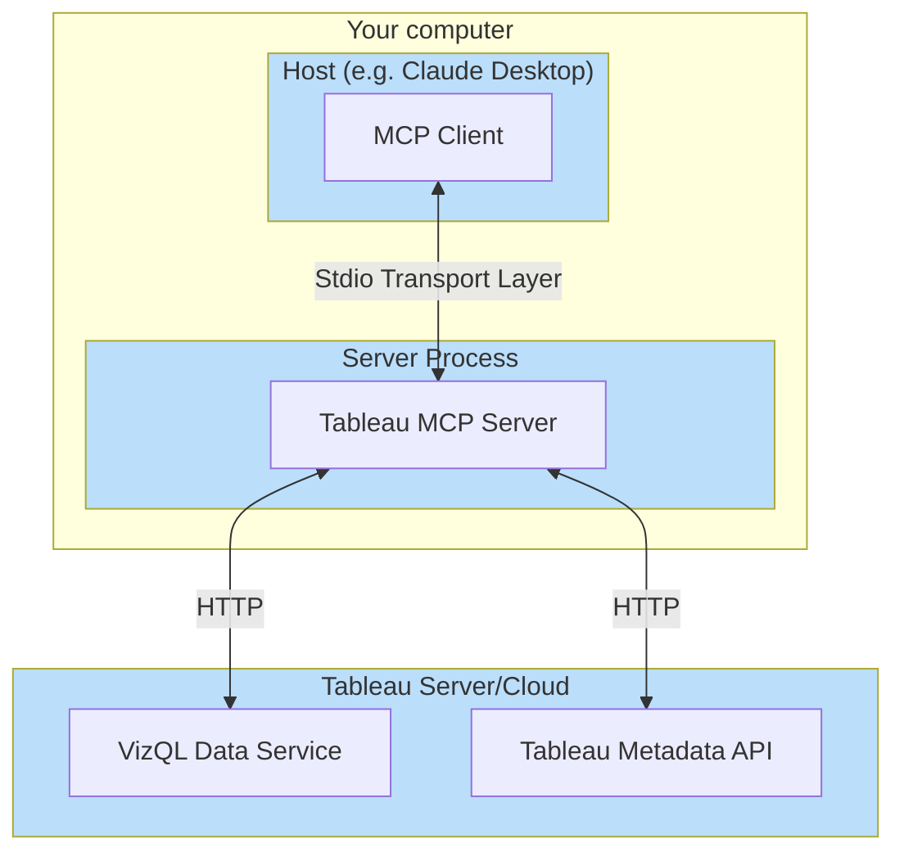

## Claude Desktop Installation

This guide walks you through everything needed to explore Tableau data via MCP using
[Claude Desktop](https://claude.ai/download) (the free version is all that’s needed). Once it’s
running you’ll be able to explore data like this example:

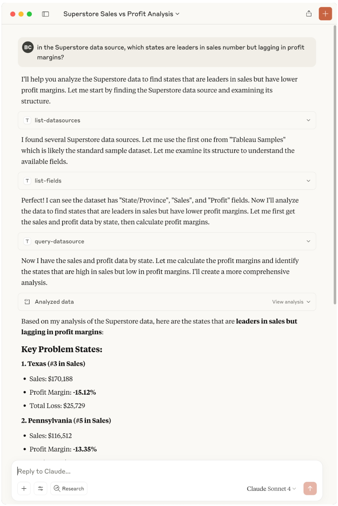

## Setup

### Identify Tableau Server or Cloud Site

Tableau MCP works with published data sources on Tableau Servers or Tableau Cloud Sites.

To connect with your data, you’ll need to create a Personal Access Token (PAT) to use with MCP.

:::info

If you don’t already have a Tableau Cloud/Server site, it’s easy to get a free one for testing by
joining the [Tableau Developer Program](https://www.tableau.com/developer). Click the join button
and follow the steps.

:::

Login to your site, then click your profile in the upper right to bring up My Account Settings.

Scroll down to Personal Access Tokens and create a new one. You can use any token name but “mcp” is
suggested. Make sure to copy and save the value because it’s only shown this one time. (Also, be
aware that Tableau PATs will expire after not being used for a couple weeks, so you may need to
periodically create a new one.)

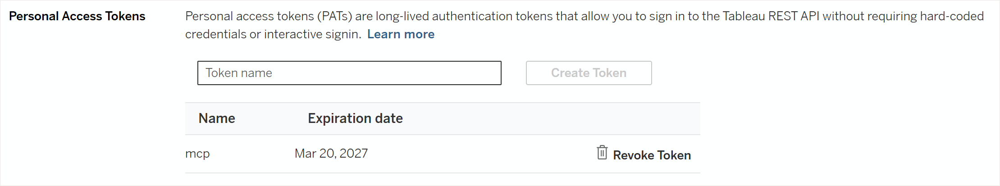

:::warning

Keep your PAT safe and don’t share with anyone or check into source control. Pay attention to the
expiration date. You can also return here to revoke the token when you no longer need it.

:::

Make note of these 4 values which you'll need later for the MCP configuration:

- SERVER (e.g. https://10ax.online.tableau.com or https://tableau.example.com)
- SITE_NAME (e.g. zapfdingbatsdev816664; on Server leave blank to use the default site)
- PAT_NAME (e.g. mcp)
- PAT_VALUE (value copied after PAT creation)

### Identify a Published Data Source

Tableau MCP works with both Tableau Server and Tableau Cloud data sources with these prerequisites:

- Only published data sources are supported
- VDS (VizQL Data Service) must be enabled (Tableau Server users may need to
  [enable it](https://help.tableau.com/current/server-linux/en-us/cli_configuration-set_tsm.htm#featuresvizqldataservicedeploywithtsm))
- Metadata API must be enabled (Tableau Server users may need to
  [enable it](https://help.tableau.com/current/api/metadata_api/en-us/docs/meta_api_start.html#enable-the-tableau-metadata-api-for-tableau-server))
- Your user must have
  [API Access enabled](https://help.tableau.com/current/api/vizql-data-service/en-us/docs/vds_configuration.html)
  on the data source
- You may need to
  [enable Tableau Pulse](https://help.tableau.com/current/online/en-us/pulse_set_up.htm) on your
  Tableau Cloud site to use Pulse API tools (Tableau Server is unable to use Tableau Pulse)

If you don’t have a published data source, you can create one like Superstore or by uploading a
CSV/Excel file and creating a published version of it.

To use a published data source with MCP, you just need to refer to it by name in the AI tool (like
Claude). See below for examples.

### Install Claude Desktop

Start by downloading and installing [Claude Desktop](https://claude.ai/download) (Mac or Windows).
Claude requires an account, so you’ll need to sign up with your email address. A free account should
suffice for simple testing with a limited number of messages (details:
[Getting started with Claude | Claude Help Center](https://support.claude.com/en/articles/8114491-getting-started-with-claude#h_57262af5ae)).
If you run into problems exceeding the free limit, you can upgrade to
[Claude Pro](https://support.claude.com/en/articles/11049762-choosing-a-claude-plan) for $20/month.

### Install Tableau MCP Extension

Tableau MCP can be built and run several different ways. Perhaps the easiest is running the
pre-built Claude Desktop Extension.

Option 1: Install from Claude Marketplace

1. Open Claude Desktop
2. Go to Settings | Extensions
3. Click on Browse Extensions
4. Search for Tableau and install it

Option 2: Install latest from MCP GitHub

1. Go to the [Releases page](https://github.com/tableau/tableau-mcp/releases)
2. For the newest release, under Assets, find and download the .mcpb file (it will be named
   something like "tableau-mcp-v1.15.0.mcpb")
3. Open Claude Desktop
4. Go to Settings | Extensions
5. Drag and drop the .mcpb file onto Claude Desktop

Once the extension is installed, you'll be prompted to configure Tableau MCP:

- SERVER
  - Cloud: pod hostname like https://10ax.online.tableau.com
  - Server: hostname like https://tableau.example.com
- SITE_NAME
  - Cloud: required, for example techandprod
  - Server: site name, or can leave blank to use the default site
- PAT_NAME (e.g. mcp)
  - The name of the PAT you created in the Tableau site settings
- PAT_VALUE (value copied after PAT creation above)

When everything is configured it should look like this:

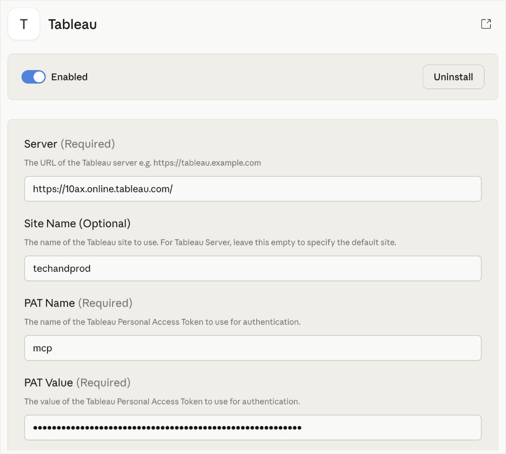

## Using Claude with MCP

### List Datasources

To verify that Claude is talking to Tableau correctly, start a new chat and try a question list
“list some of the Tableau datasources”. Claude will show a pop-up asking for permission to run the
list-datasources tool, then you should see a result like this:

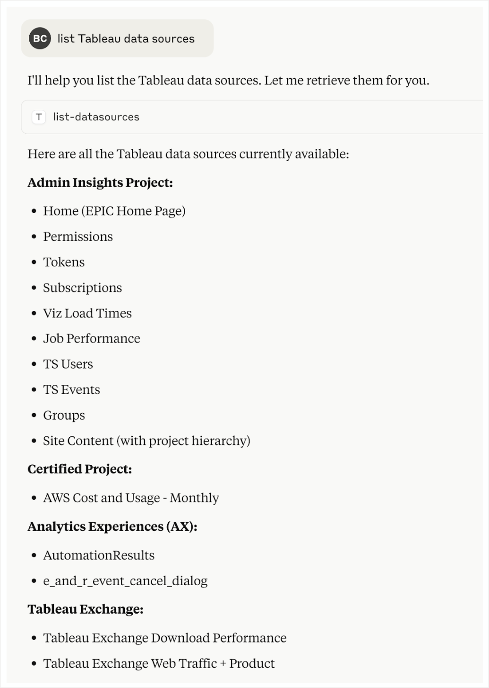

For any datasource it lists, you can ask it to explain it in more detail and even sample some data
if you like.

### Superstore

For large, shared sites, there may be a ton of “Superstore” datasources. To help narrow down to a
specific one, include additional qualifiers in your prompt, like the name of the user who owns it.

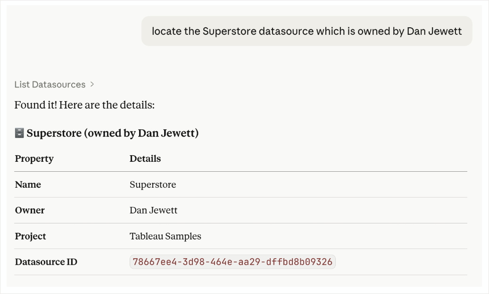

To peek under the hood and understand how the AI client (Claude) and Tableau MCP are communicating,
you can click to expand any of the tool calls it makes. For example the query above used the List
Datasources tool with a search by name and owner name:

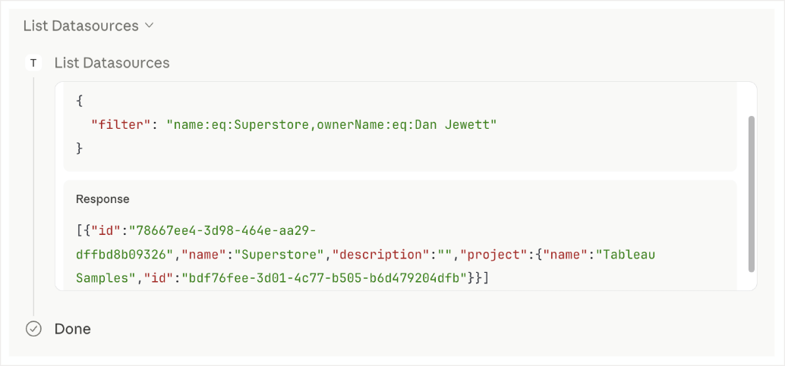

In the same chat session you can go deeper and explore the selected data. Asking the model to
explore the data and propose questions is a great cheat code:

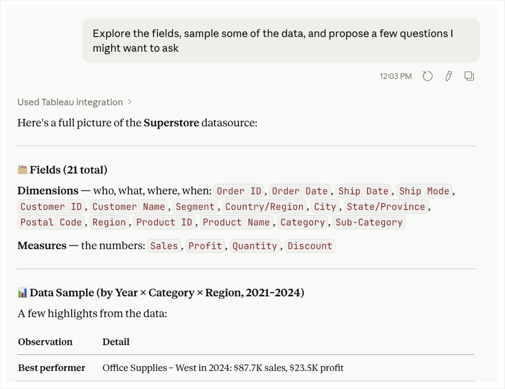

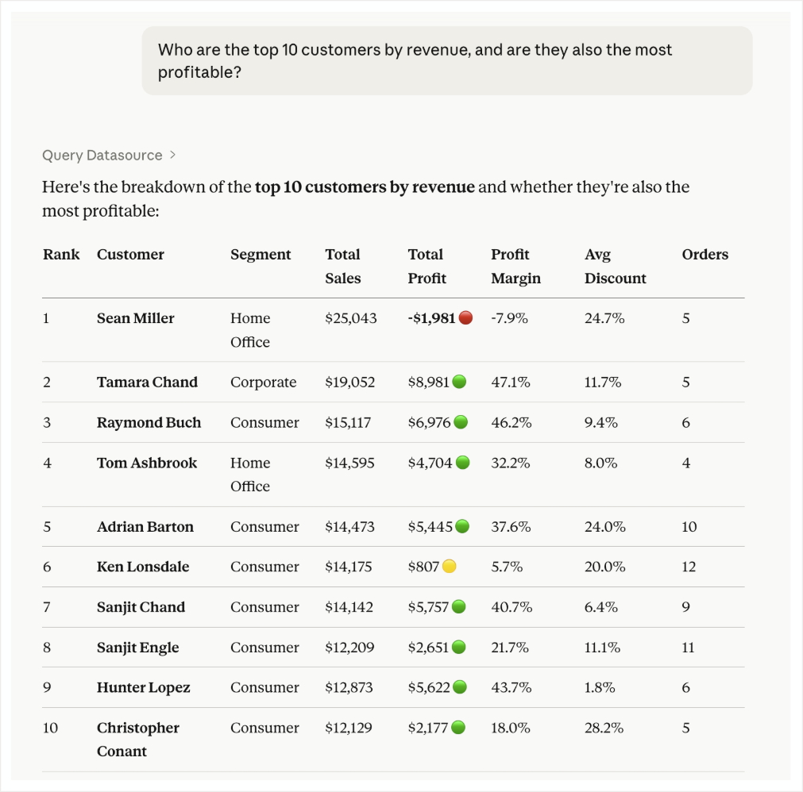

Here’s another example question along with a request to show me visually:

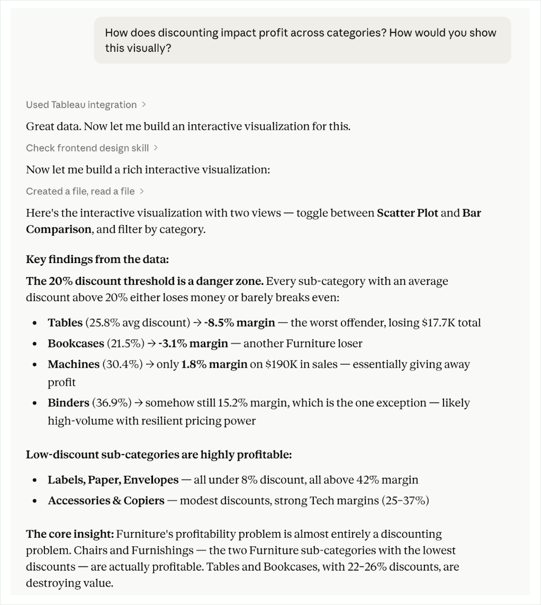

Claude also created a simple React page to visualize everything, per my request:

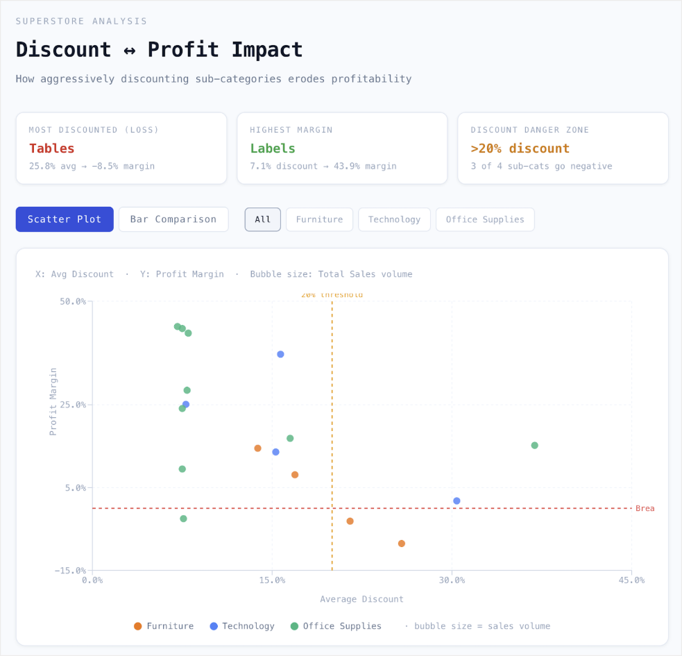

Claude calls these Artifacts and because they are single-page web content they can be published and
shared. For example this one is live here:
[discount-profit.jsx | Claude](https://claude.ai/public/artifacts/58c7eee0-55a1-4e12-aa8b-c512d88076f9).

Claude can also create other kinds of visualizations directly or by creating code snippets to do the
same.

## Explore Further

Follow along and share ideas with the Tableau MCP team by creating issues or discussions on the
repository. You can also join the [Tableau Developer Platform](https://www.tableau.com/developer)
and reach out in the [#tableau-ai-solutions](https://tableau-datadev.slack.com/archives/C07LMAVG4N6)
Slack channel in the Tableau #DataDev workspace.

The MCP project is still under development and new tools (Tableau APIs) are being regularly added.
See the README at https://github.com/tableau/tableau-mcp for the latest.

We used Claude Desktop in this example, but any MCP client should work. People on our team have used
Cursor, VScode, and other tools. The configuration for most of these follows the same pattern as
used above (“mcpServers” defined in JSON). The
[Tableau MCP documentation](https://tableau.github.io/tableau-mcp/) has more details about different
ways to configure and run, including all of the optional environment variables.

If you try a tool that doesn’t quite work, please reach out to the team to let us know.

## Troubleshooting

Here are some common issues that might come up – and how to solve them. The examples and screenshots
are from Claude Desktop but can apply similarly with any AI tools.

### 401 Unauthorized

When the AI client is using tools through Tableau MCP, it might fail and report a “401 Unauthorized”
error.

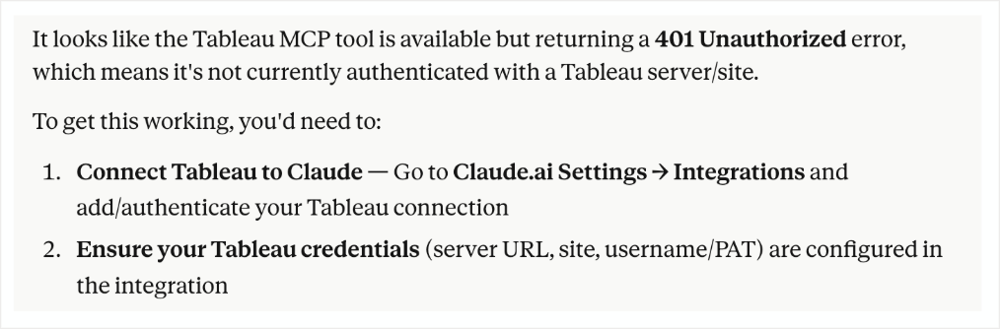

Solutions: Double-check that the server URL and site are correct Generate a new personal access
token (PATs can
[expire after 15 days if not used](https://help.tableau.com/current/server/en-us/security_personal_access_tokens.htm#change-personal-access-tokens-expiry))

### 403 Forbidden

For Tableau MCP to work, the user must have the “API access” permission enabled. In cases where the
user does not have that permission, a “403 Forbidden” error can occur.

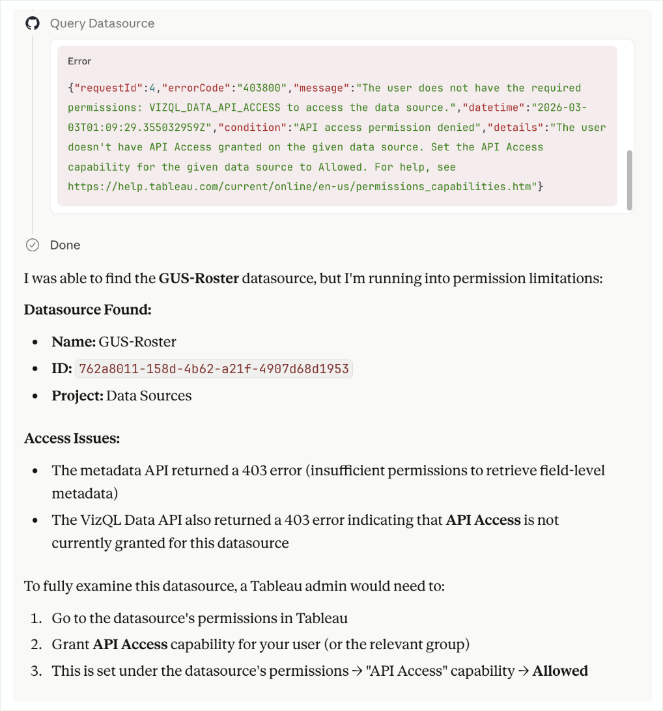

Solution:

- Grant API access to your user for that specific data source
- More likely, request that the admin or project owner do that for you
