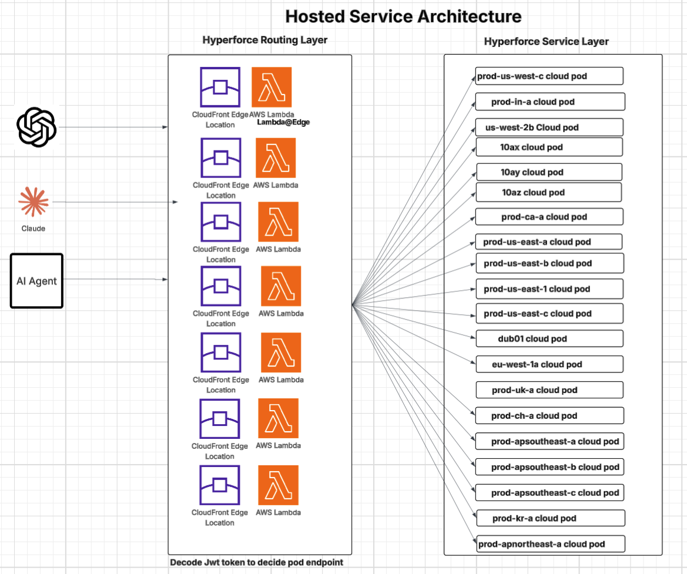

# Architecture

The hosted Tableau MCP service routes client requests through a Hyperforce routing
layer to the appropriate Hyperforce cloud pod. AI clients (such as Claude, ChatGPT,
or other AI agents) connect to a CloudFront edge location, where a Lambda@Edge
function decodes the JWT token to determine the correct pod endpoint and forwards
the request to the matching tableau cloud pod in the Hyperforce service layer.

