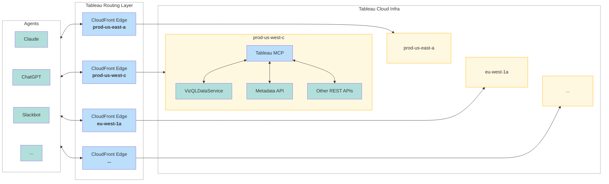

# Architecture

AI agents (such as Claude, ChatGPT, Slackbot or other AI clients) connect to the hosted
Tableau MCP service through the Tableau routing layer (CloudFront edge location+compute)
which routes the request to corresponding Tableau Cloud pod. Each cloud pod
(e.g. `prod-us-west-c`, `prod-us-east-a`, `eu-west-1a`, ...) runs its own instance of Tableau MCP, which communicates
with the pod-local VizQL Data Service, Metadata API and other REST APIs.



> **Note:** Any AI agent (Claude, ChatGPT, Slackbot, ...) can be routed to any CloudFront
> edge location. Each agent's request is directed to the nearest edge location to provide the
> best network latency, so the agent-to-edge pairing shown above is illustrative rather than fixed.

### Request routing sequence

1. An user's AI agent sends unauthenticated request to [mcp.tableau.com](https://mcp.tableau.com).
2. AI agent's unauthenticated request is routed to the nearest Cloudfront edge location to provide best network latency.
3. Unauthenticated request is sent back by Routing Layer returning an `HTTP 401` with a `WWW-Authenticate` header pointing the agent to the OAuth 2.1 flow:

   ```http
   HTTP/2 401
   www-authenticate: Bearer realm="MCP", resource_metadata="https://mcp.tableau.com/.well-known/oauth-protected-resource", scope="tableau:mcp:datasource:read tableau:mcp:workbook:read ..."

   {"error":"unauthorized","error_description":"Authorization required. Use OAuth 2.1 flow. See https://tableau.github.io/tableau-mcp/ for details."}
   ```
4. AI agent starts OAuth flow from the info provided in `www-authenticate` and completes authentication.
5. AI agent starts making authenticated requests to [mcp.tableau.com](https://mcp.tableau.com).
5. Tableau Routing Layer routes the authenticated request to the corresponding tableau cloud pod.