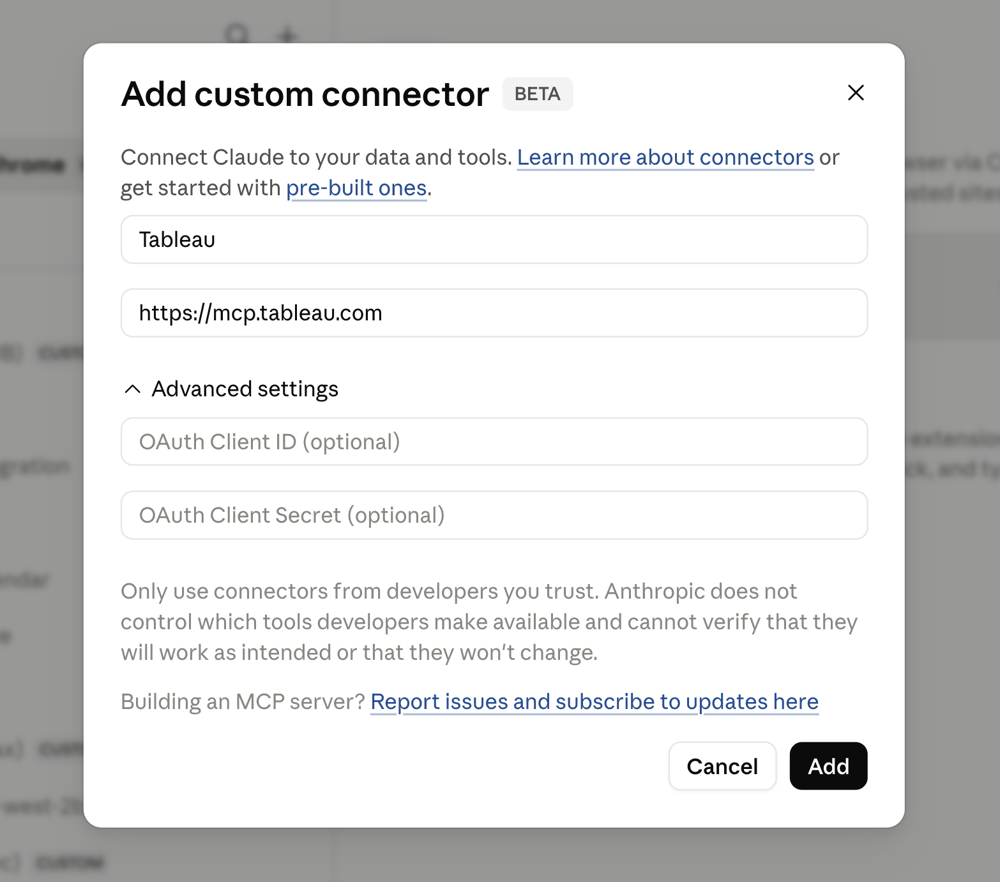

# Popular Client Integrations
This guide walks you through everything you need to use Tableau MCP with popular third-party agents.

## Slack
Coming soon! 

## Claude Product Suite
### Tableau Connector for Claude and Cowork
We'll be adding a Tableau connector to the Anthropic Marketplace soon. In the meantime, you can add Tableau as a custom connector.

<div style={{maxWidth: '75%', margin: '1rem auto'}}>



</div>

### Claude Desktop Extension
*The Tableau Extension for Claude Desktop does not actually use the hosted service. Instead, like all Claude Desktop extensions, it is a bundle that contains all the Tableau MCP code and dependencies in a single `.mcpb` package. It uses Claude Desktop's native Node.js runtime. To use the Tableau extension, you must have installed [Claude Desktop](https://claude.ai/download).*

#### Step 1: create a Personal Access Token (PAT)

Login to your site, then click your profile in the upper right to bring up My Account Settings.

Scroll down to Personal Access Tokens and create a new one. You can use any token name but something
memorable like "mcp" is suggested to make later configuration easier. Make sure to copy and save the
value because it's only shown this one time. (Also, be aware that, by default, Tableau PATs will expire after 15
days of inactivity, so you may need to periodically create a new one.)

<div style={{maxWidth: '75%', margin: '1rem auto'}}>


</div>

:::warning

Keep your PAT safe and don't share with anyone. Pay attention to the
expiration date; default expiration is 15 days. 

:::

Make note of these 4 values which you'll need later for the MCP configuration:

- SERVER (e.g. `https://10ax.online.tableau.com` or `https://tableau.example.com`)
- SITE_NAME (e.g. sales-official; on Server leave blank to use the default site)
- PAT_NAME (e.g. mcp)
- PAT_VALUE (value copied after PAT creation)

#### Step 2: Install Tableau MCP Extension

Option 1: Install from Claude Marketplace

1. Open Claude Desktop
2. Go to Settings | Extensions
3. Click on Browse Extensions
4. Search for Tableau and install it

Option 2: Install latest from Tableau MCP GitHub

1. Go to the [Releases page](https://github.com/tableau/tableau-mcp/releases)
2. For the newest release, under Assets, find and download the .mcpb file (it will be named
   something like "tableau-mcp-v1.15.0.mcpb")
3. Open Claude Desktop
4. Go to Settings | Extensions
5. Drag and drop the .mcpb file onto Claude Desktop

Once the extension is installed, you'll be prompted to configure Tableau MCP:

- SERVER
  - Cloud: pod hostname like `https://10ax.online.tableau.com`
  - Server: hostname like `https://tableau.example.com`
- SITE_NAME
  - Cloud: required, for example sales-official
  - Server: site name, or can leave blank to use the default site
- PAT_NAME (e.g. mcp)
  - The name of the PAT you created in the Tableau site settings
- PAT_VALUE (value copied after PAT creation above)

When everything is configured it should look like this:

<div style={{maxWidth: '75%', margin: '1rem auto'}}>


</div>

### Claude Code
Add Tableau MCP with the CLI:

```bash
claude mcp add --transport http Tableau https://mcp.tableau.com
```

then restart your claude code session and run `/mcp` inside Claude Code and approve the Tableau sign-in:


Verify with `claude mcp list` or `/mcp`, then select `Tableau` and `authenticate`.

## OpenAI Product Suite
A Tableau ChatGPT app and Tableau plugin for Codex is coming soon!
