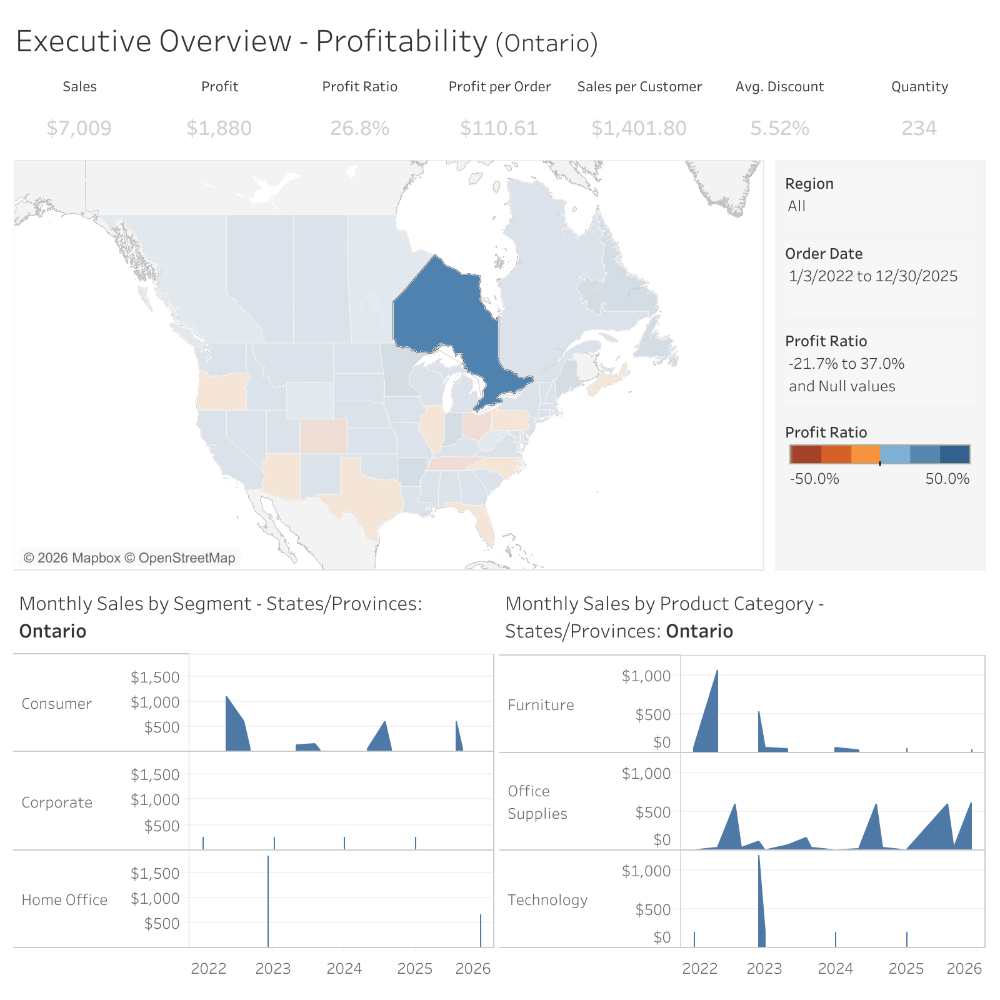

# Get Custom View Image

Retrieves an image for a **custom view** (a saved or personalized state of a published sheet,
including the user's filters). For a published view without a custom view, use
[Get View Image](get-view-image.md) with the view id.

## APIs called

- [Get Custom View Image](https://help.tableau.com/current/api/rest_api/en-us/REST/rest_api_ref_workbooks_and_views.htm#get_custom_view_image)
- [Get Custom View](https://help.tableau.com/current/api/rest_api/en-us/REST/rest_api_ref_workbooks_and_views.htm#get_custom_view)
  (to resolve the underlying sheet for
  [tool scoping](../../configuration/mcp-config/tool-scoping.md))
- [Get View](https://help.tableau.com/current/api/rest_api/en-us/REST/rest_api_ref_workbooks_and_views.htm#get_view)
  (if applicable tool scoping is enabled)

## Required arguments

### `customViewId`

The LUID of the custom view. This appears in the Tableau URL for a saved view (e.g. the
`<customViewId>` in `/views/WorkbookUrl/SheetUrl/<customViewId>/<customViewName>`), not the
published view id returned by List Views for the sheet alone.

## Optional arguments

### `width`

The width of the rendered image in pixels that, along with the value of `height` determine its
resolution and aspect ratio.

Example: `1600`

### `height`

The height of the rendered image in pixels that, along with the value of `width`, determine its
resolution and aspect ratio.

Example: `1200`

### `format`

The format of the image. Default: `PNG`

- **`PNG`** (default): Raster image format. Works with all Tableau Server versions.
- **`SVG`**: Vector graphics format. Scalable and smaller file size. **Requires Tableau Server
  2026.2.0+ (REST API v3.29+)**.

**Choosing a format:**

- Prefer `PNG` when the image will be **analyzed or interpreted** (e.g. answering questions about
  the data in the viz).
- Prefer `SVG` when the image will be **displayed to the user** (e.g. embedding or rendering the viz
  in a response).

Example: `SVG`

### `viewFilters`

Map of filter field names to values; sent as `vf_<fieldname>` query parameters per
[filter query views](https://help.tableau.com/current/api/rest_api/en-us/REST/rest_api_concepts_filtering_and_sorting.htm#Filter-query-views).

## Example result

- When `format` is `PNG`, the MCP result will contain the PNG image content (MCP result with
  `type=image` and `mimeType=image/png`).
- When `format` is `SVG`, the MCP result will contain both the SVG XML (`type=text`) and the SVG
  image content (`type=image` and `mimeType=image/svg+xml`)

