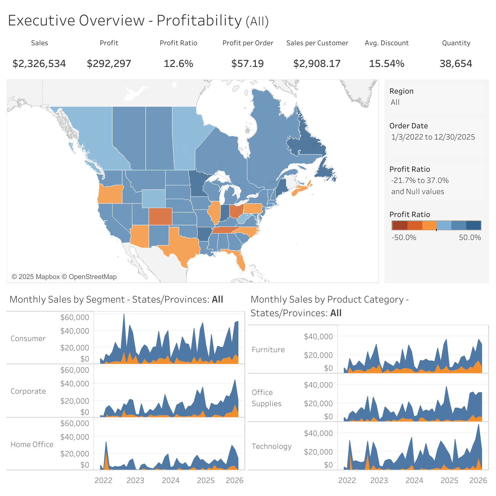

# Get View Image

Retrieves an image of the specified view in a Tableau workbook.

## APIs called

- [Query View Image](https://help.tableau.com/current/api/rest_api/en-us/REST/rest_api_ref_workbooks_and_views.htm#query_view_image)
- [Get View](https://help.tableau.com/current/api/rest_api/en-us/REST/rest_api_ref_workbooks_and_views.htm#get_view)
  (if applicable [tool scoping](../../configuration/mcp-config/tool-scoping.md) is enabled)

## Required arguments

### `viewId`

The ID of the view, potentially retrieved by the [List Views](list-views.md) or
[Get Workbook](../workbooks/get-workbook.md) tool.

Example: `9460abfe-a6b2-49d1-b998-39e1ebcc55ce`

### Optional arguments

### `width`

The width of the rendered image in pixels that, along with the value of `height` determine its
resolution and aspect ratio.

Example: `1600`

### `height`

The height of the rendered image in pixels that, along with the value of `width`, determine its
resolution and aspect ratio.

Example: `1200`

### `format`

The format of the image. Default: `PNG`

- **`PNG`** (default): Raster image format. Works with all Tableau Server versions.
- **`SVG`**: Vector graphics format. Scalable and smaller file size. **Requires Tableau Server 2026.2.0+ (REST API v3.29+)**.

**Choosing a format:**
- Prefer `PNG` when the image will be **analyzed or interpreted** (e.g. answering questions about the data in the viz).
- Prefer `SVG` when the image will be **displayed to the user** (e.g. embedding or rendering the viz in a response).

Example: `SVG`

## Example result

