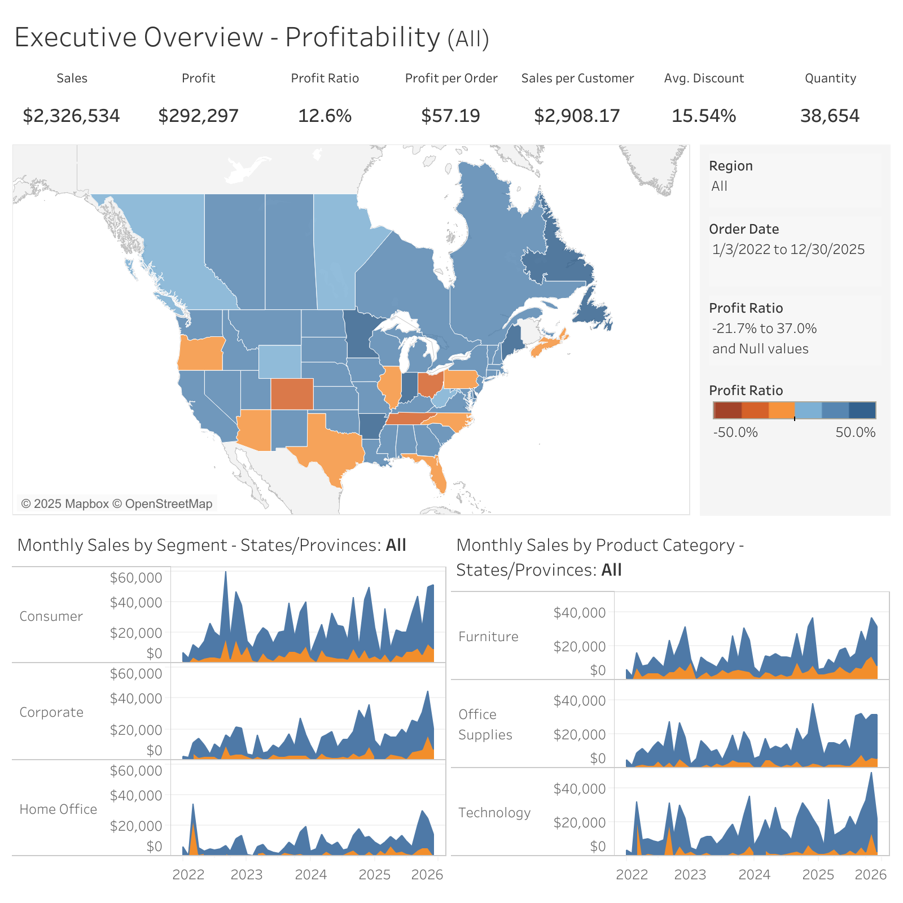

# Get View Image

Retrieves an image of the specified view in a Tableau workbook.

## APIs called

- [Query View Image](https://help.tableau.com/current/api/rest_api/en-us/REST/rest_api_ref_workbooks_and_views.htm#query_view_image)
- [Get View](https://help.tableau.com/current/api/rest_api/en-us/REST/rest_api_ref_workbooks_and_views.htm#get_view)
  (if applicable [tool scoping](../../configuration/mcp-config/tool-scoping.md) is enabled)

## Required arguments

### `viewId`

The ID of the view, potentially retrieved by the [List Views](list-views.md) or
[Get Workbook](../workbooks/get-workbook.md) tool.

Example: `9460abfe-a6b2-49d1-b998-39e1ebcc55ce`

## Optional arguments

### `width`

The width of the rendered image in pixels that, along with the value of `height` determine its
resolution and aspect ratio.

Example: `1600`

<hr />

### `height`

The height of the rendered image in pixels that, along with the value of `width`, determine its
resolution and aspect ratio.

Example: `1200`

<hr />

### `format`

The format of the image. Default: `PNG`

- **`PNG`** (default): Raster image format. Works with all Tableau Server versions.
- **`SVG`**: Vector graphics format. Scalable and smaller file size. **Requires Tableau Server
  2026.2.0+ (REST API v3.29+)**.

**Choosing a format:**

- Prefer `PNG` when the image will be **analyzed or interpreted** (e.g. answering questions about
  the data in the viz).
- Prefer `SVG` when the image will be **displayed to the user** (e.g. embedding or rendering the viz
  in a response).

Example: `SVG`

<hr />

### `viewFilters`

Map of view filter field names to values. `vf_` prefix for field names is optional and will be added
automatically when building the view filter query.

Example: `{ "year": "2017" }`

## Response behavior

The tool returns one of two result shapes:

- **Blob storage not configured/enabled (default):** returns the rendered image inline,
  base64-encoded.
  - When `format` is `PNG`, the MCP result will contain the PNG image content (MCP result with
    `type=image` and `mimeType=image/png`).
  - When `format` is `SVG`, the MCP result will contain both the SVG XML (`type=text`) and the SVG
    image content (`type=image` and `mimeType=image/svg+xml`)
- **Blob storage configured/enabled:** returns a `resource_link` with a URL to the rendered image
  in blob storage (with `mimeType` matching `format`), instead of inlining the image data.

## Example result (default)



## Example result (blob storage mode)

```json
{
  "type": "resource_link",
  "uri": "https://example-bucket.s3.amazonaws.com/...presigned...",
  "name": "view-image.png",
  "mimeType": "image/png",
  "description": "Rendered view image stored in blob storage."
}
```
