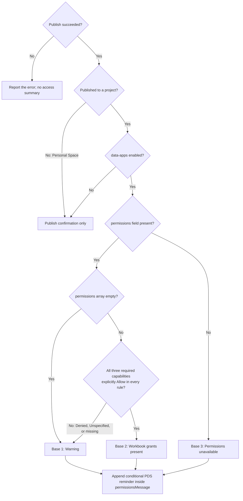

# Publish Workbook

Publishes a TWB or TWBX workbook from a local file path or staged upload id to Tableau. Provide
`projectId` to publish into a specific project (use [List Projects](../projects/list-projects.md)
with `capability: "Write"` to discover the projects you can publish to). When the `data-apps`
feature flag is enabled and `projectId` is omitted, the workbook is published into your Personal
Space (`personalSpace` defaults to `true`) when the site supports direct-to-personal-space
publishing. `projectId` always takes precedence over `personalSpace`; `personalSpace: false`
without `projectId` returns an error before any file is uploaded.

TWB workbooks are validated up front and uploaded only when validation succeeds, with any blocking
errors returned instead of publishing. TWBX workbooks are uploaded directly and validated by Tableau
as part of publishing, since Tableau cannot pre-validate extracts packaged inside a TWBX.

:::warning[Disabled by Default]

This tool is gated behind the `authoring-tools` feature flag, which
defaults to `false` in `features.json`. It is unavailable unless an administrator enables
`authoring-tools`. See [Feature Flags](../../developers/feature-flags.md).

:::

:::info[Personal Space feature flag]

Direct Personal Space publishing additionally requires the existing `data-apps` feature flag, which
defaults to `false`. When it is off, `personalSpace` is omitted from the advertised tool schema and
description, and `projectId` is required. The execution path also checks the flag: with it off, a
call with `projectId` publishes to that project, and a call without `projectId` is rejected before
API calls or file access. Project publishing remains available when `authoring-tools` is enabled.

After changing file-based flags, restart the MCP server and reconnect clients to refresh the schema.

:::

:::info[Minimum REST API version]

Requires Tableau REST API version 3.29 or later (Tableau Server
2026.2+). Calling this tool against an older server returns an error instead of publishing.

:::

Related tools: [Request Workbook Upload](request-workbook-upload.md),
[List Projects](../projects/list-projects.md)

## Required permissions

- **Site Role**: Requires Explorer (Can Publish) role or higher

## APIs called

- [Publish Workbook](https://help.tableau.com/current/api/rest_api/en-us/REST/rest_api_ref_publishing.htm#publish_workbook)
- [Validate Workbook and Upload](https://help.tableau.com/current/api/rest_api/en-us/REST/rest_api_ref_workbooks_and_views.htm#validate_workbook_and_upload)
  (TWB files only)
- [Initiate/Append File Upload](https://help.tableau.com/current/api/rest_api/en-us/REST/rest_api_concepts_publish.htm)
  (TWBX files only)
- [Query Workbook Permissions](https://help.tableau.com/current/api/rest_api/en-us/REST/rest_api_ref_permissions.htm#query_workbook_permissions)
  (after a project publish, when `data-apps` is enabled)

## Required arguments

### `name`

The name to give the published workbook.

Example: `Q3 Sales Overview`

## One of `workbookUploadId` or `workbookFilePath`

Exactly one of these must be provided — providing both, or neither, returns an error.

### `workbookUploadId`

The staged workbook upload id returned by [Request Workbook Upload](request-workbook-upload.md). Use
this for hosted clients that cannot pass a local path. Requires `MCP_S3_BUCKET` to be configured.

Example: `123e4567-e89b-42d3-a456-426614174000`

### `workbookFilePath`

Path to a local TWB or TWBX workbook file on the MCP server's filesystem. Only supported when staged
S3 uploads are not configured (i.e. `MCP_S3_BUCKET` is unset).

Example: `/path/to/Superstore.twbx`

## Destination: `projectId` or Personal Space

### `projectId`

The Tableau project LUID to publish the workbook into. Use
[List Projects](../projects/list-projects.md) with
[`capability: "Write"`](../projects/list-projects.md#capability) to discover the projects you can
publish to. If this MCP server is configured with a bounded project context,
publishing to a project outside that context returns an error instead of publishing. When
provided, it is always used and `personalSpace` is ignored.

Example: `cbec32db-a4a2-4308-b5f0-4fc67322f359`

### `personalSpace`

This parameter is advertised only when `data-apps` is enabled.

Defaults to `true`. When `projectId` is omitted, the workbook is published into your **Personal
Space**. The tool resolves the caller's Personal Space LUID automatically and sends it as a location
to Tableau; do not pass a Personal Space LUID as `projectId`.

- `projectId` provided: published to that project; `personalSpace` is ignored.
- `projectId` omitted and `personalSpace` true or omitted: published to your Personal Space.
- `projectId` omitted and `personalSpace: false`: returns an error asking for `projectId`.

The tool never falls back to a shared or default project.

The bounded project context is not applied to the caller's own Personal Space; it continues to gate
only `projectId`. Personal Space resolution requires the `tableau:projects:read` OAuth scope, which
is included in the tool's publish scope set.

Example Personal Space request:

```json
{
  "name": "Q3 Sales Overview",
  "workbookFilePath": "/path/to/Superstore.twbx"
}
```

For Personal Space publishes, the tool returns an error without publishing anything if:

- your Personal Space could not be resolved,
- your Personal Space is read-only, or
- the site has direct-to-personal-space publishing disabled.

In addition, some servers accept the request but silently land the workbook in a default project
instead of honoring the Personal Space target. In that case the workbook **is** actually published —
just to an unintended location — and the tool still returns an error so you can delete it there if
unwanted, or republish by passing an explicit `projectId`.

## Optional arguments

### `overwrite`

Whether to overwrite an existing workbook with the same name in the selected destination.

Default: `false`

## Response behavior

The tool returns one of two result shapes:

- **`status: "published"`:** the workbook was validated (TWB) or uploaded (TWBX) and published
  successfully. Includes the published workbook's data, its `url`, and any non-blocking `warnings`
  from validation.
- **`status: "invalid"`:** validation found blocking `errors` (TWB only). Nothing was published.
  `warnings` are still included alongside `errors`.

### Permissions after a project publish

When the `data-apps` feature flag is enabled, a successful project publish also returns
`permissions`: the workbook's configured user/group permission rules, and `permissionsMessage`: the
selected workbook base response followed by the conditional PDS reminder. The same fields appear
in `structuredContent` and the JSON text content. Personal Space publishes skip this read and omit these fields. If the optional read fails,
publishing still succeeds;
`permissionsNote` explains that the rules could not be retrieved, and `permissionsMessage` contains
the permissions-unavailable response. When the flag is disabled, all three permission fields and
the data-app access guidance are omitted; ordinary project publishing remains available.
See [Feature Flags](../../developers/feature-flags.md).

With `data-apps` enabled, the tool selects exactly one base response and always appends the
conditional PDS reminder inside `permissionsMessage`. Show the **publish confirmation and link**,
then relay the complete message. Do not append another PDS reminder. If `permissionsMessage` is
absent, omit the access summary.

The publish result does not identify whether the workbook contains a data app, so there is no
separate response branch for regular workbooks. Requirements use Tableau UI labels and order:

| Resource | Tableau UI capability | API capability name |
| --- | --- | --- |
| Workbook | View | `Read` |
| Workbook | Full Data Query | `Connect` |
| Workbook | API Access | `VizqlDataApiAccess` |
| Published parent data source, if used by the data app | API Access | `VizqlDataApiAccess` |

AI Access is a separate capability and does not replace API Access for the data app. Avoid
listing raw grantee IDs, every permission rule, or unrelated capabilities.

The tool selects the workbook base response from the existing results, then always appends the
conditional PDS reminder. It does not determine whether a published parent is used:



Denied and Unspecified/missing use the **same conservative warning**, while retaining their
different meanings in the returned rules. An absent capability is not rewritten as an explicit
denial. An empty `permissions` array means no configured grants were returned and routes to
Base 1; an absent `permissions` field means the rules are unavailable and routes to Base 3.
The absence of `permissionsNote` does not imply that rules were returned. Disabling `data-apps`
omits all three permission fields and the access-summary guidance entirely. A mix of complete and incomplete
grantee rules routes to Base 1.

**Base 1 — Warning**

> If this workbook contains a data app, some users with access to this project may not be able
> to view it by default. In Tableau, make sure intended data-app viewers have **View, Full Data
> Query, and API Access** on **{workbook}**.

**Base 2 — Workbook grants present**

> The returned rules grant the workbook permissions required for viewing data apps.

**Base 3 — Permissions unavailable**

> Viewer access was not verified. If this workbook contains a data app, intended viewers need
> **View, Full Data Query, and API Access** on **{workbook}**.

The tool substitutes the returned workbook name in Bases 1 and 3. Relay `permissionsMessage`
after the successful publish confirmation and link. For example, Base 2 plus the reminder is
returned as:

```json
{
  "permissionsMessage": "The returned rules grant the workbook permissions required for viewing data apps. If this workbook contains a data app backed by a published data source, viewers also need API Access on that source."
}
```

For beta, the tool always appends this conditional reminder to all three base responses:

> If this workbook contains a data app backed by a published data source, viewers also need
> **API Access** on that source.

There is no PDS-context input or known/unknown parent branch. Publishing does not establish parent
source usage. The reminder needs no parent data source lookup or permission evaluation and does
not report a verified grant or denial on the source.

These summaries describe configured defaults, not each viewer's effective access. Do not promise
everyone with project access can view the data app. Other rules, site roles, and ownership affect
the result, and a successful query by the publisher does not verify other viewers' access. See
[Effective permissions](https://help.tableau.com/current/online/en-us/permission_effective.htm).

This guidance uses existing results and task context. It adds no permission checks, data-app
detection, effective-permission calculation, or permission changes.

## Example result (published)

```json
{
  "status": "published",
  "data": {
    "id": "222ea993-9391-4910-a167-56b3d19b4e3b",
    "name": "Q3 Sales Overview",
    "webpageUrl": "https://10ax.online.tableau.com/#/site/mcp-test/workbooks/1412200",
    "contentUrl": "Q3SalesOverview",
    "project": {
      "id": "cbec32db-a4a2-4308-b5f0-4fc67322f359",
      "name": "Marketing Analytics"
    }
  },
  "url": "https://10ax.online.tableau.com/#/site/mcp-test/views/Q3SalesOverview/Overview",
  "warnings": [
    {
      "severity": "WARNING",
      "message": "Unknown map source is used",
      "line": 245,
      "column": 18,
      "elementName": "map"
    }
  ]
}
```

## Example result (invalid)

```json
{
  "status": "invalid",
  "errors": [
    {
      "severity": "ERROR",
      "message": "Unable to connect to the data source",
      "line": 12,
      "column": 4,
      "elementName": "preferences"
    }
  ],
  "warnings": []
}
```
